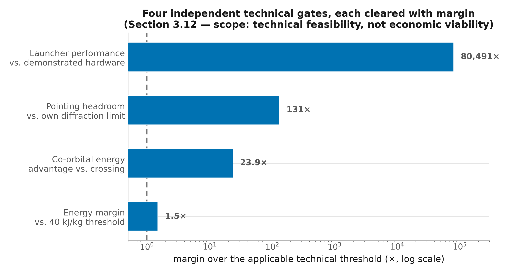
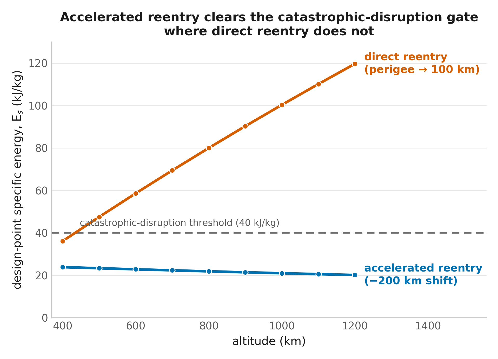
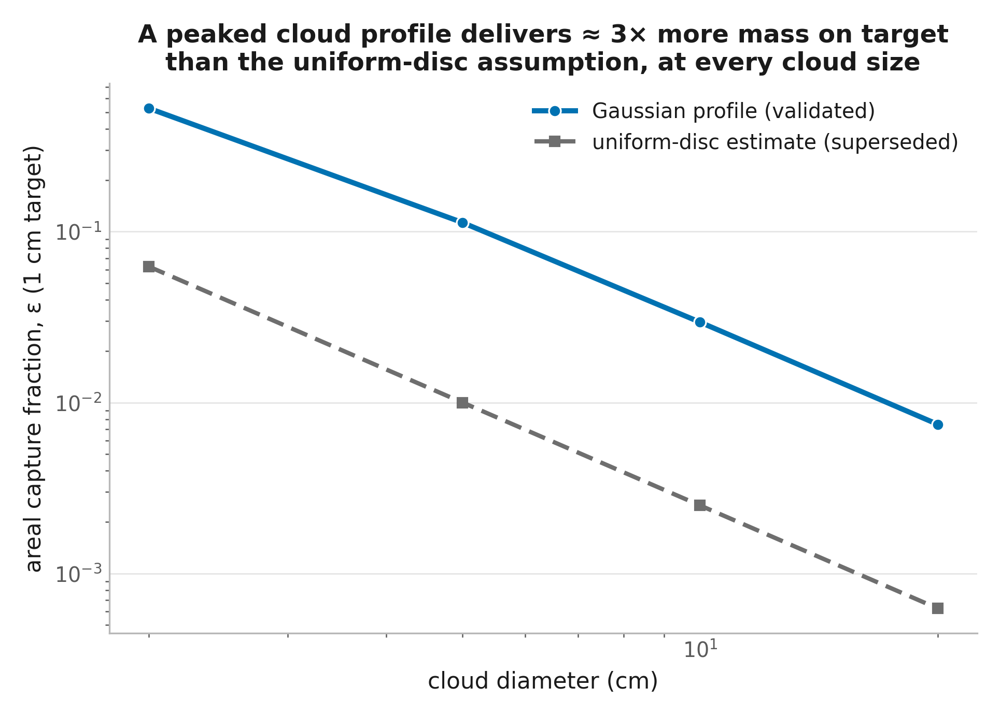
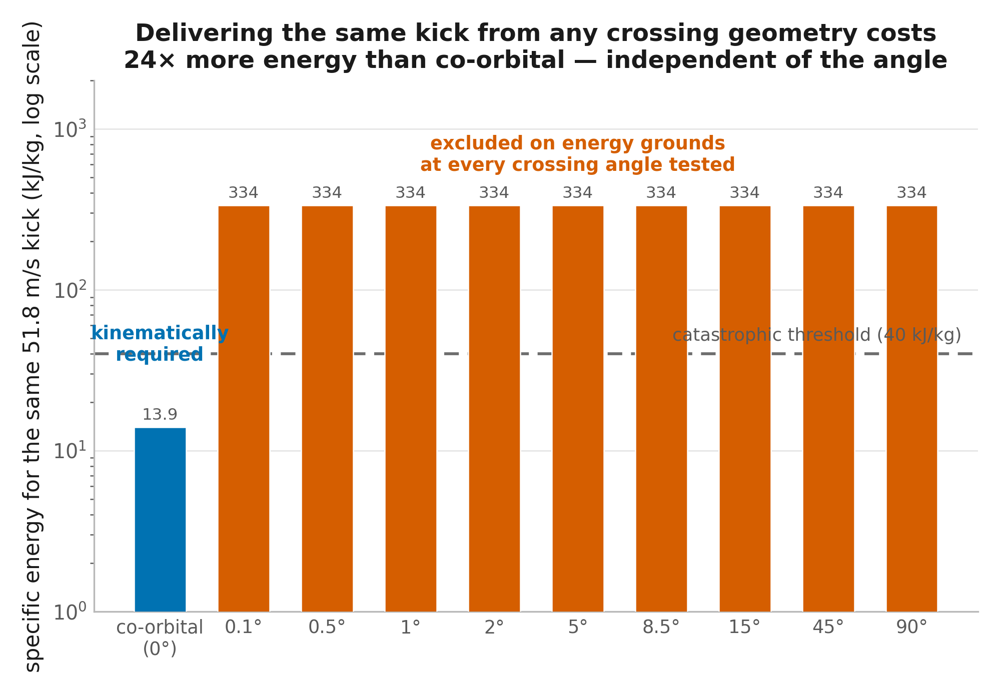
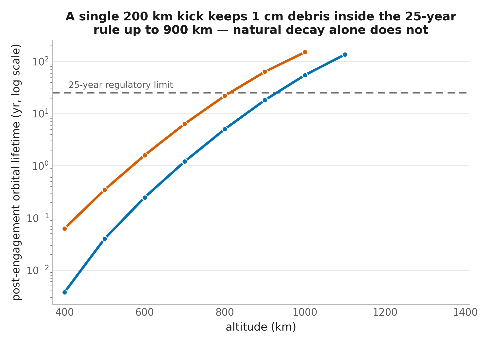
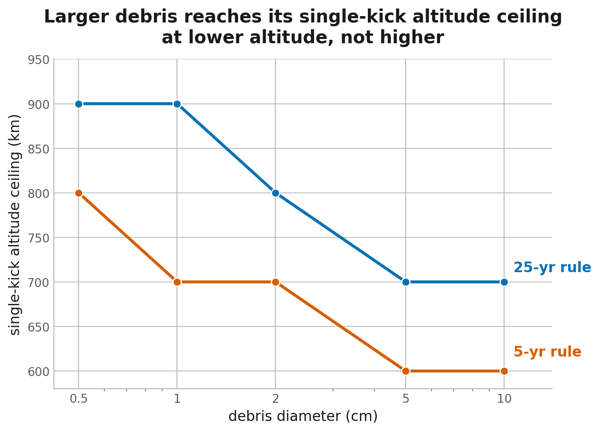
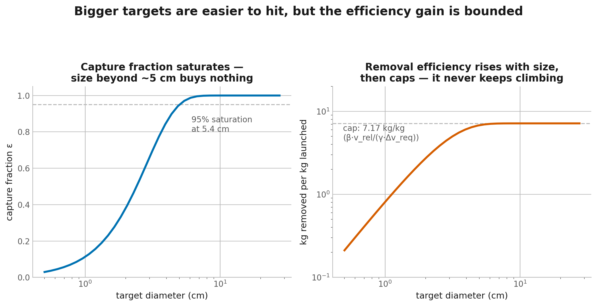
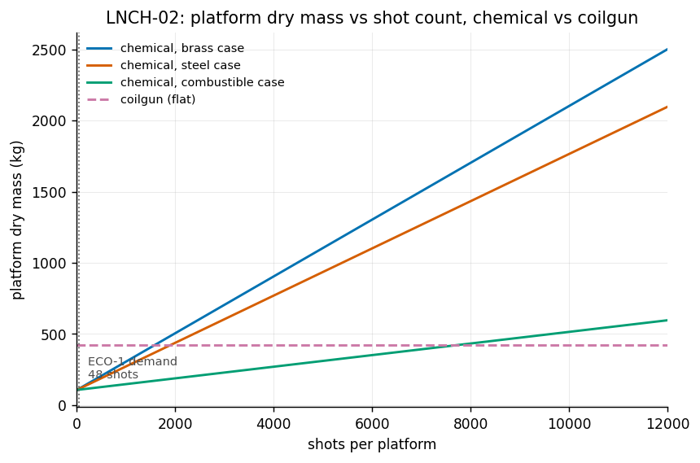
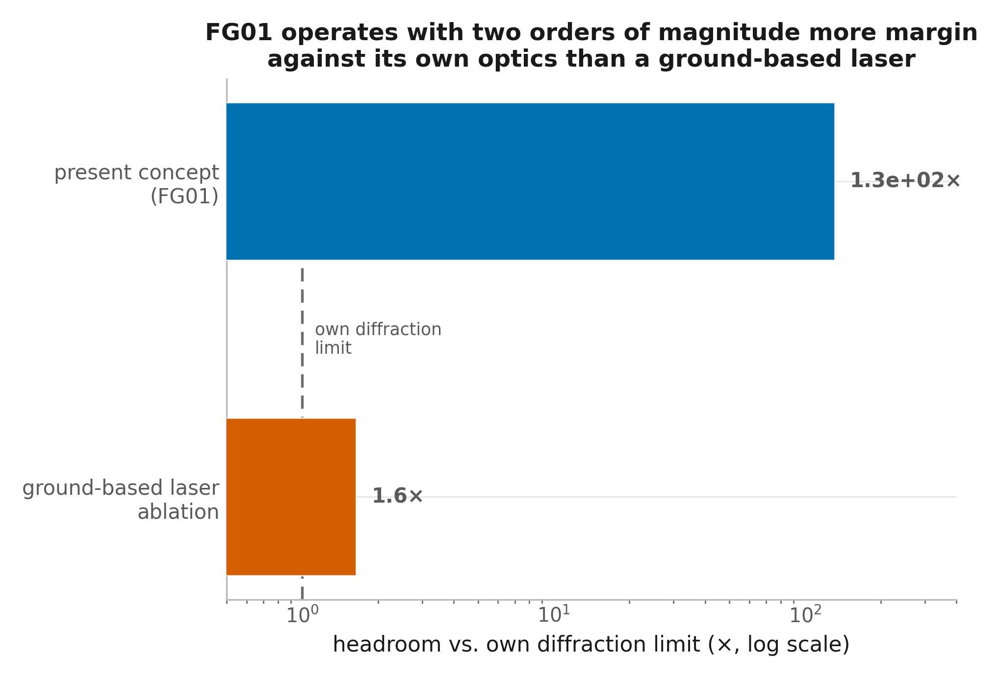

**Targeted Momentum-Transfer Remediation of Small LEO Debris: Physical Feasibility, an Orbital-Mechanics Bound on Engagement Cadence, and a Revised Comparison with Laser Ablation**

Bakhyt Zhakanov a, Karim Aubakirov a

*a Independent Researcher*

Corresponding author: Bakhyt Zhakanov (email address to be provided at submission)

**Target journal:** Journal of Space Safety Engineering (KeAI/Elsevier, published with the International Association for the Advancement of Space Safety)

---

# Abstract

Objects of characteristic length 1–10 cm in low Earth orbit are numerous — on the order of 1.2 million — individually untracked, and carry enough kinetic energy at typical encounter velocities to disable an operational spacecraft on impact. Rendezvous-based active debris removal cannot reach this population, since it depends on a tracked, catalogued, individually approachable target. This study evaluates FG01, a targeted momentum-transfer concept that engages such objects without rendezvous: a dedicated orbital platform electromagnetically launches a briefly-dispersing cloud of rhenium grains at a terminally-tracked (though not catalogued) fragment, lowering its orbit by a fixed decrement so that enhanced atmospheric drag, rather than the impact itself, completes deorbit over months to years. The analysis is implemented as a falsification-first pipeline of thirty-four linked simulation modules, with every quantitative input tagged as derived from stated physics, sourced to a specific citation, or flagged as an unvalidated engineering estimate, so that hard physical gates are checked before any downstream design or cost analysis proceeds. Two questions are kept explicitly separate throughout, and answered differently. On technical feasibility, the answer is affirmative: at the selected 900 km, 619 m/s operating point, impact specific energy sits at 0.67 times the catastrophic-disruption threshold using a momentum-enhancement factor derived from crater-ejecta scaling rather than assumed; the co-orbital engagement geometry required to keep terminal-guidance miss distance within budget is shown to be a kinematic necessity rather than a design choice; net trackable-fragment production is non-negative; reentry and ground-casualty risk are negligible; and required electromagnetic-launcher performance sits far inside demonstrated hardware. On economic competitiveness with laser ablation — the only other proposed method reaching this size class without rendezvous — the answer is negative, and the reason is structural rather than a matter of engineering optimization: a closed-form orbital-mechanics invariant, validated against numerical tour simulation, limits a realistic platform to on the order of tens of engagements per decade at the most favorable debris cluster examined, two to three orders of magnitude below what a competitive cost per object requires. This conclusion is checked, not merely asserted: it survives a platform cost reduced 42-fold below the study's own costed design, and a check of that costed design's build-cost rate against real small-satellite cost history finds it already optimistic rather than conservative. The same invariant is shown to bind a space-based laser-ablation architecture identically, indicating that the limitation is a property of the class of targeted, co-orbital, non-rendezvous concepts rather than one specific to this study's material, launcher, or platform choices. A narrow exception exists at intermediate target mass (approximately 100 kg to several tonnes), where the architecture is cost-competitive, though not efficient, against robotic-tug capture. The principal contribution of this study is therefore not the evaluation of one debris-removal concept in isolation, but a general result about the class it belongs to: for this class, technical feasibility and economic viability are governed by different constraints, and the decisive factor under present technology is achievable engagement cadence, not projectile material, launcher type, or platform cost.

**Keywords:** orbital debris remediation; momentum transfer; electromagnetic launcher; laser ablation; engagement cadence; active debris removal economics

---

# 1. Introduction

Small orbital debris — objects with characteristic length between approximately 1 and 10 cm — falls below the reliable detection and cataloging threshold of ground-based space surveillance networks in low Earth orbit (LEO), yet retains sufficient mass and closing velocity (typically 7–15 km/s in random encounters) to catastrophically damage or destroy an operational spacecraft on impact [1]. Of the roughly 1.2 million objects of this size estimated to be in orbit, only on the order of 3% are individually tracked [2]. Because this population cannot be cataloged or approached as discrete, targetable objects, the active debris removal (ADR) techniques now in operational or near-operational use — robotic-arm capture, harpoon or net rendezvous, electrodynamic tethers — are built around the assumption of a tracked, cooperative-enough target and do not extend to this size class. Demonstrated and planned ADR missions to date, including JAXA's Commercial Removal of Debris Demonstration (CRD2) rendezvous with a large, tracked upper stage [3] and ESA's planned ClearSpace-1 capture of a similarly large, catalogued object [4], are illustrative of this limitation rather than exceptions to it: both target objects many orders of magnitude larger than the population this study addresses, precisely because rendezvous-based capture requires a target that can be found, approached, and grappled.

Two classes of concept have been proposed to remediate untracked, centimeter-scale debris without requiring individual rendezvous. The first is an untargeted, persistent drag-enhancement layer: Ganguli et al. proposed injecting tens of tonnes of micron-scale tungsten dust into a debris-populated shell to raise the ambient drag experienced by everything passing through it, accelerating decay of untracked objects over roughly 25 years without ever tracking or targeting them individually [5]. This approach was not adopted operationally, for reasons that bear directly on any successor concept: an indiscriminate drag enhancement degrades the orbits of operational satellites in the same shell along with the debris it is meant to remove; the injected dust is itself a new, albeit small and short-lived, debris population that can clump; and a persistent metallic layer in LEO has documented objections from ground-based astronomy. The second class is stand-off ablation: focusing a laser — ground-based or, as examined later in this study, space-based — on a tracked-terminally-only object to vaporize surface material and use the resulting recoil as a low-thrust, non-contact deorbiting impulse. Ground-based laser ablation is the only one of these prior concepts for which a published cost benchmark exists that is claimed to reach this specific size class ($100–500/kg, theoretical) [6], and it recurs throughout this study as the primary comparator, for exactly that reason.

FG01 (referred to in earlier internal documents by the working name KIDR) is a third candidate in this space, evaluated in this study across two candidate projectile materials, rhenium and tungsten: a *targeted* momentum-transfer kick, delivered by an electromagnetically launched, briefly-dispersing cloud of rhenium grains from a dedicated orbital transporter platform, intended to combine the small-debris reach of an untargeted method with the discriminate, one-object-at-a-time engagement of a rendezvous method — at the cost of requiring the target to be detected and tracked terminally (though not catalogued or approached to rendezvous range). The simulations in this study demonstrate that this rhenium-based architecture is technically feasible, successfully performing its intended momentum-transfer mission and satisfying every physical, safety, and demonstrated-hardware criterion evaluated in Section 3. Projectile material is evaluated as a formal trade study (Section 3.9) rather than assumed, and that trade returns two findings which are reported together. First, rhenium — the material originally proposed for this concept, on the premise that its high density improves momentum-transfer efficiency — is not justified on that premise: momentum p = mv is independent of density at fixed projectile mass, so density governs only grain size, and tungsten is superior on unit cost, global availability, and oxide toxicity at a density penalty of 8.4%. Second, and the reason this finding does not drive the study's conclusion, material cost is not the binding term in the cost relation at any engagement count examined: platform cost and achievable engagement cadence are. Both materials are therefore carried through the analysis, and every headline result is reported in a form that holds for either. Where a single material must be named for concreteness, rhenium is used, as the originally proposed implementation whose evaluation this study was constructed to perform.

The central question this study is built to answer follows directly: given that the redesigned, rhenium-based concept is technically feasible, can it compete economically with the only other candidate that reaches this size class without full rendezvous or catalog-grade tracking, laser ablation? The simulations answer the feasibility question affirmatively: the redesigned architecture satisfies every catastrophic-disruption, terminal-guidance, launcher-hardware, and reentry-safety criterion evaluated, at a stated margin rather than at the boundary of the gate. The financial analysis in Section 3 answers the economic question negatively: under present manufacturing capability, spacecraft cost, and the orbital-mechanics constraint on achievable engagement cadence, the concept is not economically competitive with laser-based alternatives. These are separate findings, reported separately, because the paper's central contribution is the distinction between them — not a claim about the optimal projectile material.

*Figure 6. The technical-feasibility side of the paper's central finding: four independent gates — specific-energy margin, engagement-geometry advantage, pointing headroom, and launcher performance — each cleared with margin at the design point (Section 3.12). [View on GitHub](https://github.com/KakiroX/FG01/blob/main/manuscript_figures/fig6_feasibility_gates.png).*

*Figure 7. The economic-competitiveness side: cost per object remains far above ground-based laser ablation's matched-physics cost band across every engagement rate and platform-cost assumption tested, including an optimistic sensitivity case (Section 3.11). [View on GitHub](https://github.com/KakiroX/FG01/blob/main/manuscript_figures/fig7_cost_vs_engagements.png).*

The redesign evaluated here departs from an earlier design target for the same concept, which sized delivered impulse to force a target's immediate reentry and was found, in a preceding iteration of this analysis, neither technically feasible nor economically viable on several independent grounds; that record is retained in full elsewhere in this study rather than set aside, consistent with a standing commitment to report unfavorable findings with the same prominence as favorable ones. Section 2 details how changing the impulse target — shifting the orbit by a fixed decrement and letting atmospheric drag complete the deorbit, rather than forcing immediate reentry — and changing the engagement geometry together resolve the physical grounds on which that earlier design failed.

Beyond establishing feasibility, this study extends the analysis in two respects central to the economic question above. First, an engagement-cadence analysis identifies the quantity that actually governs cost at scale: a closed-form orbital-mechanics invariant — relating achievable engagement rate to nodal regression rate, transfer cost between successive targets, and mission duration — is derived, validated against a full numerical tour simulation, and shown to limit a realistic platform to on the order of tens of engagements per decade at the most favorable debris cluster examined, independent of vehicle, material, or launcher design, and independent of platform cost. This is two to three orders of magnitude below the engagement count a competitive cost per object would require, and the finding holds even under an optimistic, largely unsupported platform-cost assumption used in this study only as a lower-bound sensitivity check. It also holds regardless of projectile material: material cost is a minor contributor to total mission cost at realistic engagement counts, well below the platform and engagement-cadence terms that actually govern competitiveness with laser ablation, so the conclusion is unchanged whether rhenium, the reference implementation evaluated throughout, or an alternative such as tungsten is used. Both are reported with the same weight as the positive physical findings above, consistent with this study's standing commitment against selective reporting. A narrow window remains cost-competitive, though not propellant-efficient, against alternative capture methods for intermediate-mass objects of order 100 kg to several tonnes (Section 3), contingent on a programmatic judgment this study does not settle. Second, a from-first-principles rebuild of the comparison against laser ablation — both ground-based and space-based — corrects a previously reported cost benchmark that had never been derived under the same engagement-geometry assumptions used for FG01 itself, narrowing an apparent five-to-six-order-of-magnitude cost disadvantage to two-to-four orders of magnitude — still decisive — while also showing that the orbital-mechanics cadence limit found here applies to any co-orbital, momentum-delivery competitor, including a space-based laser, rather than being specific to FG01's material or hardware choices. Throughout, this study retains the traceability convention established in the prior iteration: every quantitative input is tagged as DERIVED (obtained by algebraic or numerical derivation from stated physics), SOURCED (obtained from a specific, cited external source), or UNVALIDATED (an engineering assumption for which no direct experimental or literature source exists at the relevant length- and velocity-scale), so that the evidentiary basis for each numerical claim in Sections 3–4 remains auditable independent of the surrounding prose.

Section 2 describes the governing physics of the redesigned engagement, the corrected terminal-guidance model, the closed-form engagement-cadence derivation, and the laser-ablation comparison built on matching assumptions. Section 3 presents results organized around the same two questions this Introduction opens with: technical feasibility, which the simulations support, and economic competitiveness with laser ablation, which the financial analysis does not. Section 4 discusses what it means for the binding constraint on this concept to be economic and logistical — a general orbital-mechanics limit on achievable engagement cadence, not material, consumable, or launch-hardware cost — for this concept's narrow intermediate-mass niche and for the broader class of targeted, co-orbital, non-rendezvous debris-remediation concepts it belongs to. Section 5 concludes.

---

# 2. Materials and methods

## 2.1 Analytical framework, falsification gates, and traceability

The analysis is implemented as a linked pipeline of thirty-four simulation modules organised into five families: the core physics and system sequence (SIM-0 – SIM-14), the cloud–debris interaction model (INT-0 – INT-6), the engagement-economics model (ECO-1 – ECO-5), the comparative laser benchmark (LAS-1 – LAS-4), and launcher-specific ballistics (GUN-1, COIL-1). Modules share a common library providing orbital mechanics, atmospheric density, relative motion, breakup modelling, interaction physics, and debris-population routines, so that every downstream module reads upstream results at runtime rather than through re-entered constants.

The architecture is deliberately falsification-first. Rather than sizing a design and checking constraints afterwards, hard physical boundaries are evaluated *before* any design work: the catastrophic-disruption boundary (Section 2.4) and the orbital-decay requirement (Section 2.7) are each formulated as pass/fail gates that a candidate operating point must clear before guidance, launcher, platform, or cost analysis proceeds. Where no design point satisfies a gate, that outcome is reported as a primary result rather than resolved by parameter adjustment.

Every quantitative input carries one of three traceability tags: **DERIVED** (obtained algebraically or numerically from stated, non-controversial physics), **SOURCED** (traceable to a specific citation), or **UNVALIDATED** (an engineering assumption for which no direct experimental or literature source exists at the relevant length- and velocity-scale). Inputs carrying uncertainty are propagated as distributions rather than point values (Section 2.12), and results dependent on UNVALIDATED inputs are reported as envelopes. The complete pipeline is reproducible from a single command with pinned dependency versions and a fixed pseudorandom seed.

## 2.2 Scope: target classes and deorbit modes

Two target classes are analysed, because the governing physics is mass-independent while the delivery economics are not.

**Small debris** comprises solid aluminium-6061 spheres of 0.5–10 cm diameter, representing the untracked fragment population that lies below the reliable ground-surveillance threshold in low Earth orbit yet retains sufficient mass and closing velocity to disable an operational spacecraft [7,8]. **Mid-mass objects** comprise intact tracked bodies of approximately 10²–10⁴ kg, representing spent upper stages and defunct satellites of the class targeted by conventional active debris removal [9]. The specific impact energy governing catastrophic disruption (Section 2.4) is independent of target mass, so a single interaction model spans both classes; what differs is the areal efficiency of cloud delivery (Section 2.5.2), which improves as target cross-section grows, and the projectile mass required, which scales linearly with target mass.

Two deorbit modes are evaluated against both classes.

**Direct reentry** lowers the target perigee to 100 km in a single engagement, producing reentry within minutes. **Accelerated reentry** lowers the orbit by a finite decrement Δh (evaluated at 150, 200 and 250 km), after which natural atmospheric drag completes the deorbit over months to years. The two modes impose substantially different impulse requirements at the same altitude, and therefore different specific impact energies; both are evaluated across the full altitude range so that the trade between impulse magnitude and post-engagement orbital lifetime is resolved rather than assumed. Success is defined differently for each: perigee below 100 km for direct reentry, and post-engagement orbital lifetime below the applicable regulatory threshold for accelerated reentry (Section 2.7).

## 2.3 Orbital mechanics and the deorbit impulse requirement

For a target in a circular orbit at altitude *h*, the velocity decrement required at apogee to lower perigee to a target altitude *h*p follows from the vis-viva relation [10]:

Δ*v*(*h*, *h*p) = √[μ/(*R*E+*h*)] − √{μ[2/(*R*E+*h*) − 2/(2*R*E+*h*+*h*p)]}  (1)

where μ is Earth's gravitational parameter and *R*E the mean equatorial radius [DERIVED]. Direct reentry sets *h*p = 100 km; accelerated reentry sets *h*p = *h* − Δ*h*. Equation (1) is evaluated across *h* = 400–1200 km. Because the required impulse for a fixed altitude decrement decreases with altitude while the impulse for direct reentry increases, the two modes diverge substantially over the tested range, and this divergence propagates directly into the disruption gate through Equation (3).

Momentum conservation for a projectile of mass *m*p striking a target of mass *m*t at relative velocity *v*rel, with momentum-enhancement factor β accounting for ejecta-augmented coupling, gives

*m*t Δ*v* = β *m*p *v*rel  (2)

from which the required projectile mass and the design mass ratio *f*(*h*) = *m*p,design/*m*t follow, with an explicit engineering margin γ applied to projectile mass. The mass ratio is independent of target mass and of engagement range; it depends only on altitude (through Δ*v*), on *v*rel, and on β.

## 2.4 Catastrophic disruption gate

Substituting the minimum projectile mass from Equation (2) into the specific-energy definition *E*s = ½*m*p*v*rel²/*m*t — the governing quantity of the NASA Standard Breakup Model [11] — yields

*E*s(*h*, *v*rel, β) = γ Δ*v*(*h*) *v*rel / (2β)  (3)

Equation (3) is notable for being independent of target mass, which is why a single gate serves both target classes. A collision is treated as catastrophic when *E*s equals or exceeds 40 kJ kg⁻¹, evaluated across the 30–50 kJ kg⁻¹ range to span the threshold's reported uncertainty [11,12]. Inverting Equation (3) gives the maximum relative velocity admissible at a given altitude without crossing into the catastrophic regime. This gate is evaluated first, for both deorbit modes, before any subsequent module executes; the substitution in Equation (3) is verified algebraically and Equation (1) is cross-checked against an independent Hohmann-transfer formulation.

## 2.5 Cloud–debris interaction model

Treating a dispersed projectile swarm as a single macroscopic impactor of equal total mass is a modelling assumption, not a validated equivalence. The interaction model therefore resolves the swarm explicitly, so that bulk momentum delivery and per-impact specific energy are computed as separate quantities rather than conflated.

### 2.5.1 Momentum coupling from crater-ejecta scaling

The momentum-enhancement factor β is derived rather than assumed, using crater-ejecta scaling theory [13,14]. Momentum enhancement above unity requires target material to be ejected at speeds exceeding the impactor's own momentum contribution; the mass of such ejecta is governed by the ratio of impact velocity to the target's strength velocity. For aluminium-6061 the strength velocity is of order 3×10² m s⁻¹, so an impact at the engagement velocities admitted by Equation (3) occurs at only a small multiple of that value, and the ejecta contribution is correspondingly modest. The projectile predominantly embeds, penetrating several times its own diameter, which represents the physical floor β = 1. The same scaling evaluated at conventional hypervelocity conditions (≈6 km s⁻¹) reproduces the momentum enhancements of β ≈ 2–3 reported in the impact and asteroid-deflection literature [14,15], which serves as the model's consistency check. Because no direct measurement exists for rhenium- or tungsten-on-aluminium impacts at centimetre scale and sub-kilometre-per-second velocity, β retains an UNVALIDATED tag and is propagated as a distribution.

### 2.5.2 Cloud areal density and mass efficiency

Following release, the projectile swarm's spatial evolution is modelled using linearised Clohessy–Wiltshire relative motion in the Hill frame [16], propagated to the intercept plane to yield a two-dimensional areal number-density field. Only projectile mass incident on the target silhouette transfers useful momentum, so the governing quantity is the mass efficiency ε, the ratio of on-target mass to launched mass. For a Gaussian transverse profile and a target small relative to the cloud, ε scales as the square of the ratio of target diameter to cloud diameter, with a coefficient approximately three times more favourable than the uniform-disc idealisation. This quantity is where the two target classes diverge most sharply: the areal penalty that dominates engagement of a centimetre-scale fragment becomes negligible for a metre-scale body.

### 2.5.3 Aggregate delivery and aim tolerance

Total delivered impulse is obtained by summing grain-level coupling over the incident population, giving Δ*v*imparted = ε *m*L β̄ *v*rel/*m*t for launched mass *m*L. Aim error is treated not as a binary hit-or-miss outcome but as a continuous reduction in ε: for a Gaussian cloud displaced from the target centre, on-target mass falls off exponentially with the square of the miss distance, so holding delivered impulse constant requires launched mass to increase by the reciprocal factor. Engagement reliability is therefore purchased with launched mass along a smooth, finite penalty curve rather than encountering a discontinuous failure threshold. Launched mass scales as the square of the miss distance, making launcher pointing accuracy and muzzle-velocity repeatability the dominant engineering sensitivities; both are treated as UNVALIDATED engineering estimates and swept.

### 2.5.4 Secondary ejecta and net debris

Because each engagement comprises many individual impacts, secondary-ejecta production is evaluated at the aggregate level. Per-impact crater volume from the scaling relations of Section 2.5.1 is summed over the incident population, and the resulting ejecta mass distribution is classified against the 1 mm and 1 cm trackability thresholds using the non-catastrophic (cratering) branch of the Standard Breakup Model [11], rather than the catastrophic-fragmentation branch applicable above the disruption threshold. Net debris flux is computed as objects removed minus trackable fragments generated minus projectile mass remaining in orbit.

## 2.6 Engagement geometry and terminal guidance

Engagement geometry is resolved in three dimensions rather than as a scalar closing speed, because the two differ materially in their consequences. Decomposing the relative velocity into components shows that only the component anti-parallel to the target's orbital velocity produces the along-track impulse that lowers the orbit; a crossing engagement expends the remainder on a cross-track impulse that rotates the orbital plane without reducing altitude, while incurring the full specific energy of the encounter in Equation (3). Delivering a given orbit-lowering impulse from a crossing geometry therefore requires substantially more specific energy than from a co-orbital geometry, and for realistic crossing angles this places the engagement well inside the catastrophic regime. Crossing engagements are consequently excluded on kinematic grounds before guidance performance is considered, and the admissible engagement geometry is restricted to a narrow retrograde, in-plane cone.

Within that cone, terminal accuracy is computed from an explicit error budget combining launcher pointing uncertainty, muzzle-velocity repeatability, target state uncertainty over the tracking arc, and control-loop latency. The transverse miss contribution is evaluated using the true cross-line-of-sight rate obtained from the relative-motion solution, not the scalar closing velocity; because the admissible geometry is co-orbital, this rate is small and the latency contribution to miss distance is correspondingly modest across the tested range. Miss distance is then mapped to launched-mass penalty through Section 2.5.3.

## 2.7 Orbital decay and reentry

### 2.7.1 Atmosphere model

Atmospheric density is obtained from the NRLMSISE-00 empirical model [17], evaluated at solar-minimum, nominal and solar-maximum conditions (F10.7 = 70, 150, 250). To make repeated propagation tractable, density is pre-tabulated on an altitude grid and interpolated; interpolation error against direct model evaluation is verified to remain below 0.02%.

### 2.7.2 Propagation

Post-engagement orbital lifetime is computed by two independent methods. Near-circular orbits are integrated using the orbit-averaged decay relation d*a*/d*t* = −*C*D(*A*/*m*)ρ(*h*)√(μ*a*) [18], while eccentric post-impulse orbits — which traverse several orders of magnitude of density variation per revolution — are propagated by full three-dimensional Cartesian integration including J2 and atmospheric co-rotation. The two methods are cross-validated against one another; comparison is performed on mean rather than osculating elements, since J2 induces kilometre-scale periodic oscillations in osculating semi-major axis that would otherwise mask genuine agreement. Model output is additionally compared against the documented decay history of an object of known geometry and area-to-mass ratio.

Orbital lifetime is evaluated for target debris in both deorbit modes, and separately for projectile mass that misses its intended target. For missed mass, the post-launch trajectory is computed from launch geometry rather than assumed: a retrograde launch at relative velocity exceeding the direct-reentry impulse requirement places the missed projectile on a trajectory whose perigee lies below the sensible atmosphere, so its orbital persistence is determined by that geometry rather than by its ballistic coefficient alone.

### 2.7.3 Reentry ablation

Reentry survival is evaluated using rate-limited stagnation-point convective heating after Fay–Riddell theory [19], rather than a total-energy ablation budget, since reentry heating is rate- rather than energy-limited. The ablation threshold is set at the melting transition with aerodynamic melt-stripping, consistent with the definition of the effective ablation enthalpies used for metallic materials, rather than at the vaporisation point. Ablated mass fraction, surviving ballistic coefficient and ground-casualty expectation are computed for both target and projectile materials across the tested size range, and compared against the accepted 10⁻⁴ per-event casualty threshold [20].

## 2.8 Electromagnetic launcher

Launcher requirements are computed from standard electromagnetic-launch energy relations, with kinetic energy ½*m*p*v*² converted to required electrical energy through a stage efficiency swept over 0.3–0.5, and stage count, bore length, conductor gauge and capacitor mass derived from established coilgun scaling relations [21]. Required performance is compared against demonstrated laboratory and test-article benchmarks rather than projected capability, so that the achievable mass–velocity envelope constrains the design space rather than being fitted to it.

## 2.9 Debris population and engagement cadence

Engagement opportunity is modelled from orbital mechanics rather than assumed. Fragments originating in a common breakup event share an inclination but disperse in right ascension of the ascending node, because differential nodal precession under J2 varies with semi-major axis and inclination [10,22]; the resulting spread is computed as a function of time since the parent event. A platform can engage only those objects whose geometry falls within the admissible cone of Section 2.6, so opportunity counting combines the population's spatial density with the relative drift rate and the cone geometry.

Reaching successive targets, however, requires the platform to match each target's orbit. The propulsive cost per engagement is derived in closed form from the nodal-precession rate, orbital velocity and mission duration, and validated against numerical tour simulation. This quantity is central to the economics because opportunity count and per-engagement propulsive cost both scale linearly with the width of the altitude band serviced, so the two effects cancel and the per-engagement cost is invariant with respect to that design choice. Achievable engagement count over a mission is therefore set by the platform's total velocity budget divided by this per-engagement cost. Population inputs are taken from established debris-environment models [8,23], with the caveat that the majority of the ≥1 cm population is statistically modelled rather than individually catalogued.

## 2.10 Cost model

The cost model is formulated parametrically, as a structural relation between inputs rather than an evaluation at a single design point. Cost per object removed is

*C*object = (*C*platform + *C*ops)/*N*eng + *m*L*P*material + *E*shot*P*elec  (4)

where *C*platform is derived from a subsystem mass budget (structure, avionics, power, launcher, propulsion, thermal control) combined with a build cost per unit dry mass and a launch price per unit wet mass, with propellant sized by the Tsiolkovsky relation for the velocity budget of Section 2.9; *N*eng is the achievable engagement count; *m*L is launched projectile mass per engagement from Section 2.5.3; and *E*shot is launcher electrical energy from Section 2.8.

Each input is swept across a stated range rather than fixed: dry mass, build cost per kilogram, launch price per kilogram, fleet size with an associated learning-curve exponent, velocity budget, and material unit price. Results are therefore reported as surfaces over this parameter space, with the sensitivity of *C*object to each input reported explicitly (Section 2.12). Because Equation (4) is dominated by its first term wherever *N*eng is small, the model's structure implies that platform mass and achievable engagement count, rather than consumable cost, govern the outcome; revised subsystem mass estimates or launch prices substitute directly into the same relation without altering its form. Material prices are dated at the point of use, since the unit price of rhenium moved by a factor of approximately three over the period spanned by the analysis [24].

## 2.11 Comparative benchmarking

Candidate remediation methods are compared on a like-for-like basis using published performance and cost assessments, with each competing approach evaluated for applicability to the target class in question: laser ablation and other contactless methods for the small-debris class [5,25], and rendezvous-and-capture removal vehicles for the mid-mass class [9,26]. Because the concept under study and several of its comparators are at differing technology-readiness levels, comparisons state the maturity of each method alongside its cost estimate, and terminal-accuracy requirements are computed on a common basis rather than taken from source claims.

## 2.12 Uncertainty quantification

All parameters carrying a stated uncertainty range are propagated jointly through the full pipeline by Monte Carlo sampling with 10⁶ draws and a fixed seed, rather than by one-at-a-time sweeps, which do not correctly characterise variance in a nonlinear, multi-constraint system [27]. Viability is defined as the joint satisfaction of the constituent constraints — sub-catastrophic specific energy, achievable delivery accuracy, compliant post-engagement orbital lifetime, non-negative net debris flux, and a stated cost criterion — evaluated simultaneously on each sample. First-order and total-effect Sobol sensitivity indices [28,29] are computed to attribute output variance among inputs, with convergence diagnostics reported. Where a cost criterion expressed per unit mass is not meaningful for very small targets, a per-object criterion is reported alongside it rather than substituted silently.

## 2.13 Verification and validation

Each module carries verification appropriate to its physics: Equation (1) is cross-checked against an independent Hohmann formulation and the Equation (3) substitution verified algebraically; the relative-motion solution is checked against analytical solutions; the two orbital-decay propagators are cross-validated on mean elements and compared against an observed decay history; the crater-ejecta scaling is verified to reproduce published momentum enhancement at hypervelocity conditions; the closed-form per-engagement velocity cost is compared against numerical tour simulation; atmospheric interpolation is verified against direct model evaluation; and Monte Carlo convergence is confirmed by sample-size scaling. Verification residuals are reported with each result rather than aggregated, and all external numerical inputs are recorded in a citation log stating, for each value, whether it was independently verified against a primary source, inherited from prior work without independent verification, or estimated.

## 2.14 Mapping of methods to research questions

| Research question | Governing method |
|---|---|
| Viability of momentum-transfer removal | §2.4, §2.5, §2.12 |
| Dispersed cloud versus discrete grains; grain sizing | §2.5.1–2.5.2 |
| Sufficiency of imparted impulse | §2.3, §2.7.2 |
| Maximum serviceable altitude | §2.7.2 |
| Launch geometry and angle | §2.6 |
| Projectile mass per unit target mass, *f*(*h*) | §2.3, §2.5.3 |
| Delivery accuracy and its consequence | §2.5.3, §2.6 |
| Secondary debris generation | §2.5.4 |
| Energy per engagement; launcher sizing | §2.8 |
| Cost per object and per unit mass | §2.9, §2.10 |
| Comparison against alternative methods | §2.11 |
| Reentry survival of target and projectile | §2.7.3 |
| Regulatory and environmental compliance | §2.7.2, §2.7.3 |

---

# 3. Results

Results are organized to mirror the module sequence in Section 2 (Table 2.14) and are presented as paired **Data** / **Interpretation** statements throughout: each finding is stated first as a quantitative result with its originating module, then interpreted against the research question it addresses. Section 3.11 (engagement cadence and cost) carries its own scope note explaining what it supersedes and why; every subsection in this section reports figures already validated in the project record, and none is pending.

## 3.1 Catastrophic-disruption boundary: direct versus accelerated reentry

**Data.** Evaluating Equation (1)–(3) across 400–1200 km altitude, using the originally assumed momentum-enhancement value (β = 1.5, engineering margin γ = 2) so that this sweep is evaluated on a consistent basis, shows that direct reentry (perigee lowered to 100 km in one engagement) requires Δv of 87.4–290.0 m/s and yields a design-point specific energy of 36.1–119.7 kJ/kg — at or above the 40 kJ/kg catastrophic-disruption threshold at every altitude tested. Accelerated reentry (a fixed 200 km orbit-lowering decrement) requires only 48.7–57.7 m/s over the same range, yielding 20.1–23.8 kJ/kg — below the threshold at every altitude, with the safe intercept-velocity ceiling correspondingly rising from 2,079–2,463 m/s (SIM-0). Balancing this altitude-dependent safety margin against the altitude-dependent remediation value established in Section 3.6 selects 900 km as the operating point carried through the remainder of this section, at a fixed 619 m/s intercept velocity (SIM-13).

*Figure 1. Accelerated reentry (a fixed 200 km orbit-lowering decrement) holds design-point specific energy at 20–24 kJ/kg across the 400–1200 km band, below the 40 kJ/kg catastrophic-disruption threshold, whereas direct reentry (perigee lowered to 100 km in one engagement) exceeds it at every altitude tested (SIM-0, Section 3.1). [View on GitHub](https://github.com/KakiroX/FG01/blob/main/manuscript_figures/fig1_disruption_boundary.png).*

**Interpretation.** The two deorbit modes are not interchangeable design choices with similar risk: direct reentry places the design point at or above the catastrophic-fragmentation gate by construction, independent of engineering margin, while the accelerated-reentry redesign clears the same gate with room to spare across the full altitude band tested. This is the structural result that makes every downstream module in this section evaluable at all. The specific-energy figures above use the originally assumed β = 1.5; Section 3.2 replaces this with a physically derived value and recomputes the design-point figure accordingly, so the two should not be read as competing estimates of the same quantity.

## 3.2 Momentum coupling: β from crater-ejecta scaling

**Data.** The momentum-enhancement factor β, computed from crater-ejecta scaling rather than assumed, is 1.17–1.68 (central 1.30) at the 619 m/s design velocity, falling to an oblique-incidence-corrected value of 1.20 when averaged over a curved target surface. The same scaling relation evaluated at 6 km/s reproduces β ≈ 2–3, matching literature values for hypervelocity impact and asteroid-deflection experiments (CHK-01, INT-2). Embedding depth for a 450 μm grain at 619 m/s is 1.46 mm — 3.2 times the grain diameter, well short of perforating a 1 cm target. Substituting this corrected β = 1.20 into Equation (3) at the 900 km/619 m/s operating point selected in Section 3.1 raises the design-point specific energy from 21.4 kJ/kg (at the originally assumed β = 1.5) to 26.7 kJ/kg — 0.67× the catastrophic threshold, and the figure carried through the remainder of this section and the Abstract.

**Interpretation.** β is derived, not fitted or assumed, and its hypervelocity limit reproduces independently reported values, which is the validation check for the scaling relation. At the design velocity the impact is embedding-dominated rather than ejecta-dominated, which is the physical reason β sits close to its floor of 1.0 rather than the higher values sometimes assumed in early-stage designs. The correction raises required projectile mass by a factor of 1.25 and the design-point specific energy by the same factor, but the result remains comfortably sub-catastrophic — the qualitative finding of Section 3.1 is unchanged by the correction, only its exact margin.

## 3.3 Cloud areal density and mass efficiency

**Data.** For a Gaussian transverse cloud profile, the fraction of launched mass incident on a 1 cm target (ε) is 0.527 at a 2 cm cloud diameter, 0.113 at 5 cm, 0.0295 at 10 cm, and 0.0075 at 20 cm — a factor of approximately 3 more favorable at every cloud size than the uniform-disc estimate used previously (0.25, 0.04, 0.01, 0.0025 respectively), validated against grain-by-grain Monte Carlo to within 2.16 Monte Carlo standard errors (INT-1).

*Figure 3. A peaked (Gaussian) cloud profile places roughly three times as much mass on a 1 cm target as the earlier uniform-disc assumption at every cloud size, a purely geometric correction that lowers required launched mass by the same factor at fixed miss tolerance (INT-1, Section 3.3). [View on GitHub](https://github.com/KakiroX/FG01/blob/main/manuscript_figures/fig3_areal_efficiency.png).*

**Interpretation.** A peaked (Gaussian) cloud profile concentrates mass where the target actually is, which is a purely geometric correction to the earlier, more conservative uniform-disc assumption; it lowers required launched mass by roughly a factor of three at fixed miss tolerance without any change to the underlying physics of momentum transfer.

## 3.4 Aggregate delivery, aim tolerance, and secondary debris

**Data.** At the design point (1 cm target, 900 km, β = 1.201, 619 m/s, 5 cm cloud), 1.75 g of launched projectile mass delivers 197 mg on target via 197 individual grain impacts, meeting the required Δv on 91% of simulated shots; a 10 cm cloud raises this to 99.98% at a proportionally higher launched mass (INT-3/4). The resulting 197 impact craters excavate 370 mg of target material (26% of target mass); the largest single crater is 1.39 mm across — a factor of seven below the 1 cm trackability threshold. Net trackable-object flux per engagement, counting the target removed against any new fragment at or above 1 cm, is +1 (INT-5).

**Interpretation.** Aim error degrades delivered momentum continuously through the areal-capture fraction rather than causing a binary hit/miss outcome, so a larger cloud buys reliability at a quantifiable, finite mass cost rather than encountering a cliff. Net debris production is evaluated here from crater geometry directly rather than by extrapolating a hypervelocity fragmentation model outside its calibration range, and it shows no new trackable fragments are produced at the design point — a stronger and more directly grounded version of the non-catastrophic finding in Section 3.1.

## 3.5 Engagement geometry and terminal guidance

**Data.** Isolating engagement geometry from the engineering-margin question addressed in Sections 3.1–3.2 (i.e. evaluated at γ = 1, no safety margin, so that the comparison below reflects geometry alone), delivering a fixed 51.8 m/s retrograde kick from a co-orbital, launcher-supplied approach costs 13.9 kJ/kg of specific energy; delivering the identical kick from any crossing geometry — evaluated from 0.1° to 90° of plane offset — costs 333.5 kJ/kg, invariant of the specific crossing angle, and 8.3 times the catastrophic threshold. Co-orbital engagement is therefore more energy-efficient by a factor of 2·v_orbital/|w| = 23.9, verified against explicit three-dimensional orbital states to 2.8×10⁻¹¹ (cosine) and 2×10⁻¹⁶ (relative-velocity magnitude). Within the resulting admissible engagement cone (≤1.5° for a ≤10% energy penalty, ≤5° to remain sub-catastrophic), the terminal miss-distance budget at the design range (10 m) totals 5.775 mm and is dominated by launcher pointing and muzzle-velocity dispersion rather than by control-loop latency, which contributes negligibly across the tested range of 0.1 μs to 100 ms (SIM-4, INT-0).

*Figure 2. Delivering the same 51.8 m/s retrograde kick from any crossing geometry costs ~334 kJ/kg — above the catastrophic threshold and invariant of plane angle from 0.1° to 90° — against 13.9 kJ/kg co-orbital, a factor of 23.9; co-orbital engagement is therefore forced by energy balance as a kinematic requirement, not selected as a guidance preference (INT-0, Section 3.5). [View on GitHub](https://github.com/KakiroX/FG01/blob/main/manuscript_figures/fig2_coorbital_vs_crossing.png).*

**Interpretation.** Co-orbital engagement was previously treated as a guidance-driven design preference; it is shown here to be a kinematic requirement forced by momentum balance before guidance performance enters the analysis at all; a crossing engagement is excluded on energy grounds regardless of how well it can be aimed. This finding independently accounts for why terminal-guidance miss distance is insensitive to control latency in the redesigned engagement — the earlier concern that control-loop latency would collapse hit probability applies to a crossing-style engagement geometry that the energy gate already rules out.

## 3.6 Orbital decay and post-engagement lifetime

**Data.** For a 1 cm target, natural (unkicked) orbital lifetime rises from 0.06 yr at 400 km to 63.5 yr at 900 km and beyond 200 yr above 1200 km; a single 200 km accelerated-reentry kick reduces post-engagement lifetime to 0.004–18.2 yr over the same range, an acceleration factor of 16.7× at 400 km falling to 3.5× at 900 km. The orbit-averaged propagation model is cross-validated against full three-dimensional Cartesian integration to 0.01% over 400 revolutions and against a documented decay history to within 9.8% (SIM-2).

*Figure 4. A single 200 km accelerated-reentry kick brings 1 cm debris inside the 25-year post-engagement rule up to roughly 900 km, whereas natural decay alone exceeds the rule at the higher end of the band; the crossing of the two curves with the regulatory limit sets the single-kick altitude ceiling (SIM-2, Section 3.6). [View on GitHub](https://github.com/KakiroX/FG01/blob/main/manuscript_figures/fig4_orbital_lifetime.png).*

**Data — altitude ceiling by debris size.** The same single-kick calculation extends across the sub-5 cm class: under the 25-year post-kick rule, the single-kick altitude ceiling is 900 km at 0.5 cm and 1 cm, falling to 800 km at 2 cm and 700 km at 5 cm; under the stricter 5-year rule the ceiling is 800 km at 0.5 cm, 700 km at 1 cm and 2 cm, and 600 km at 5 cm. Larger debris reaches its ceiling at lower altitude because its lower area-to-mass ratio decays slower for the same 200 km kick — the diagonal in size and altitude, not a single altitude threshold, is what bounds where a kick delivers 25-year (or 5-year) compliance (SIM-2).

*Figure 9. Larger debris reaches its single-kick altitude ceiling at a lower, not higher, starting altitude, under both the 25-year and 5-year post-kick disposal rules (200 km kick, nominal solar case). [View on GitHub](https://github.com/KakiroX/FG01/blob/main/manuscript_figures/fig9_altitude_ceiling_by_size.png).*

**Data — three opposing size scalings.** Three effects of target size on delivered outcome work in different directions and are each derived rather than assumed (INT-6). (i) Capture fraction ε rises steeply with target size and saturates near 0.95 at a 5.4 cm target for a 5 cm cloud radius — beyond that point essentially every launched grain is already caught, and the saturation diameter is set by aim error via the cloud size, not by the target itself. (ii) At fixed launched mass, delivered momentum is favorable, but the actually useful ratio — mass removed per unit mass launched — caps at 7.17 kg/kg once ε saturates (set by β·v_rel/(γ·Δv_req), independent of target size); below saturation this ratio is worse by exactly a factor of ε, so a 1 cm target removes only 0.8 kg per kg launched against 7.17 at saturation. (iii) Area-to-mass ratio scales as 1/diameter, so bigger targets decay more slowly per unit of kick Δv, partially offsetting the easier-capture gain. A fourth, smaller effect works in the concept's favor: cratering excavates more mass than the projectile adds (a net −12% mass change at the 1 cm design point), so area-to-mass rises by 14% and post-kick lifetime falls by a further 12% beyond the kick's direct Δv effect — an order-of-magnitude estimate, not a calibrated one, but favorable in sign.

*Figure 10. The two opposing scalings behind the diagonal envelope: capture fraction ε saturates near 5 cm (left), and the useful figure of merit — mass removed per unit mass launched — saturates at the same size rather than continuing to improve (right), for a 5 cm cloud radius. [View on GitHub](https://github.com/KakiroX/FG01/blob/main/manuscript_figures/fig10_size_scaling_tradeoffs.png).*

**Interpretation.** The kick is most effective exactly where it is least needed (low altitude, already-short natural lifetime) and least effective where debris density is highest (600–1000 km); the resulting single-kick altitude ceiling (900 km for 1 cm debris under the 25-year rule) is a genuine, altitude-dependent limit on remediation value rather than a free design parameter, and it is validated to the same standard used elsewhere in this study rather than taken from a fitted curve. Because the ceiling itself falls with debris size while capture efficiency rises with it, the set of (size, altitude) combinations for which a single kick delivers genuine remediation value is a narrow diagonal band rather than a simple size- or altitude-only cutoff: easier-to-hit large debris is harder to deorbit from the same kick, and easier-to-deorbit small debris is harder to hit at long range. This diagonal-envelope structure is a property of the decay and capture physics alone; it does not depend on, and is not affected by, the engagement-cadence and cost findings of Section 3.11.

## 3.7 Reentry ablation and ground-casualty risk

**Data.** Design-range projectile grains (0.05–1 mm) and target debris up to 5 cm fully demise on reentry under rate-limited stagnation-point heating; a surviving 10 cm fragment retains only 5×10⁻⁴ J of impact energy. Ground-casualty expectation is effectively zero at every tested population density, against the accepted 10⁻⁴ per-event threshold (SIM-8).

**Interpretation.** Neither the target debris nor the projectile material at the sizes this design actually uses poses a measurable reentry hazard; this removes ground-casualty risk as a binding constraint on the concept, independent of the outcome of any other section.

## 3.8 Launcher: electromagnetic and chemical-propellant alternatives

**Data.** Rhenium cannot be driven by a reluctance coilgun (its paramagnetic susceptibility, χ ≈ +7×10⁻⁵, gives a ferromagnetic armature nothing to grip) or serve as its own induction armature (conductivity 5.42×10⁶ S/m, 11 times worse than copper); the design therefore uses a thin aluminium canister as a combined armature and payload container, with no discarded sabot, independent of target size. For FG01's actual small-debris design shot — 1.75 g of rhenium/tungsten payload (Section 3.4) plus its aluminium canister/armature, 2.14 g total accelerated mass at 619 m/s, 410 J kinetic energy — the required coilgun performance sits 80,491× inside demonstrated electromagnetic-launch hardware (GUN-01). A separate comparison, sized instead to a 100 g projectile — the regime relevant to the larger, intermediate-mass target class considered separately in this study, where required muzzle energy is roughly 20× higher — finds a multistage induction coilgun at 619 m/s requires 95.3 kJ of stored capacitor energy across 67 stages (2.95 m), essentially invariant across a tenfold range of acceleration limit, against a chemical-propellant alternative delivering 400 m/s from the same 100 g mass at 85.4 MPa peak chamber pressure (25 mm bore, 0.6 m barrel, 15% margin below the pressure limit; a 20 mm bore cannot reach 400 m/s within the same limit at any barrel length tested). At this larger payload mass, total system mass favors the chemical-propellant launcher below roughly 1,600 shots and the coilgun above it (GUN-01, COIL-01, CHK-01).

**Data — small-debris launcher trade, weighted (LNCH-01).** A three-way weighted trade against chemical and railgun alternatives, run at both the actual small-debris design shot (410 J, 2.14 g, 619 m/s) and the 100 g large-object shot above, returns opposite winners at the two energies and explains why: at 410 J the stored-energy requirement is under 1 kg for every launcher type, so system mass is not a discriminator and the coilgun wins on secondary metrics — no consumable, clean operation next to the terminal optics, best muzzle-velocity repeatability (0.07% against 0.62% chemical), and 10⁵–10⁷ shot life with no sliding contact (weighted score 0.77 against 0.60 railgun, 0.54 chemical). At the 192 kJ large-object shot the ranking inverts: capacitor mass reaches 319 kg against 0.13 kg of propellant, so the chemical launcher is roughly 14× lighter and wins outright. Pulsed-capacitor storage (~1.5 kJ/kg) cannot compete with propellant (~4 MJ/kg of available work) once per-shot energy exceeds a few kilojoules, and the FG01 small-debris shot sits four to five orders of magnitude below that crossover (LNCH-01).

**Data — platform-level trade at large-object energies (LNCH-02).** Costing the launcher in isolation understates the difference at the *large-object* shot energy, because the coilgun's stored-energy requirement there propagates into the power and thermal subsystems that serve it. Re-running the platform mass budget for both launchers at the 100 g/95.3 kJ shot and an illustrative 48-shot mission demand returns a dry mass of 108.1 kg for the chemical configuration against 419.7 kg for the coilgun — a factor of 3.88 — driven mainly by a 150 kg power plant sized to recharge the capacitor bank (95.3 kJ in 21 s = 4.5 kW), which is removed entirely with the chemical launcher. This is a finding about the *large-object* regime specifically, not the small-debris design point: at 410 J the equivalent power draw is on the order of tens of watts, and the 150 kg power-plant penalty does not arise. It is directly relevant to the intermediate-mass niche discussed in Section 4.2, where it complements the ECO-5 tug comparison with a launcher-level cost driver ECO-5 does not itself model (LNCH-02).

**Data — coilgun structural walls.** At the COIL-01 400 m/s, 100 g design point (31 stages, 30 mm bore), the launcher's mass is dominated by the capacitor bank (28.2 kg, 83%) and coil copper (4.17 kg, 12%); the combined structural walls — outer case, bore tube, and coil banding — total only 1.7 kg (5%). Peak magnetic pressure on the coil is 34.2 MPa, carried by 0.93 mm S-glass/epoxy banding at a safety factor of 2; the bore tube must be an electrical insulator (G10/FR4 or PEEK, not metal), since a conductive tube acts as a shorted turn around the armature and destroys the magnetic coupling. The full radial envelope at this bore is 52 mm outer diameter over the 1.36 m, 31-stage barrel length, of which the winding itself — not the structural walls — is the largest single contributor to wall thickness (5.2 mm of 10.9 mm total, driven by fitting 22 turns of AWG 10 wire in two layers) (COIL-02, COIL-03).

**Data — chemical-gun barrel sizing at the 619 m/s design velocity.** A separate case sizes the chemical-propellant barrel to reach the full 619 m/s design-point intercept velocity (rather than the 400 m/s figure above) from the same 100 g mass, using a larger 30 mm bore and 1.0 m length: peak chamber pressure is 89.1 MPa, and a tapered Ti-6Al-4V barrel (2.97 mm wall at the chamber, thinning to a 1.5 mm practical minimum at the muzzle, plus a 1 mm Inconel 718 liner over the first 15 cm for erosion) has a mass of 0.72 kg, 47% lighter than a constant-wall barrel sized to the peak pressure throughout. This shows the chemical alternative can reach the 619 m/s figure used elsewhere in this study at 100 g, given a larger bore than the 400 m/s/25 mm case; it does not by itself change the ~1,600-shot mass-crossover point above, which was computed at 400 m/s and a smaller bore and has not been re-derived at this configuration (GUN-02).

*Figure 11. Platform dry mass versus shot count at the 100 g/95.3 kJ large-object shot energy, for the chemical launcher (brass, steel, and combustible cartridge cases) against the coilgun. At this energy, once the capacitor-charging power plant is counted, the platform-level mass crossover moves from 545 shots (launcher hardware alone) to 1,572–7,683 shots depending on case material. This comparison applies to the intermediate-mass regime discussed in Section 4.2, not to the small-debris design shot, where the equivalent power draw is negligible and does not arise (LNCH-02, Section 3.8). [View on GitHub](https://github.com/KakiroX/FG01/blob/main/fg01_v5/figures/lnch02_crossover.png).*

**Interpretation.** The choice of launcher technology is not a single, concept-wide decision but depends on which target class is being engaged, and two independent lines of evidence now agree on this rather than one. For FG01's actual small-debris design shot, launcher physics is not a limiting constraint by a wide margin, and both the direct launcher-only comparison and the weighted multi-criterion trade (LNCH-01) find the coilgun the appropriate choice, with no chemical-gun alternative competitive at that scale — it wins on consumable-free operation, cleanliness next to the terminal optics, muzzle-velocity repeatability, and shot life, none of which the chemical alternative can match once its own drawbacks (a metered sub-gram charge, hot particulate exhaust near precision optics, and a magazine that must be resupplied) are weighed in. The 100 g comparison is a separate question, answered oppositely, and relevant only if the larger intermediate-mass target class is pursued (Section 4.2): there, the coilgun's capacitor-charging power plant adds roughly 150 kg that a chemical-launcher platform does not carry, and LNCH-02's platform-level analysis finds the chemical launcher preferable at that scale even after its own costs — added recoil, faster erosion, live propellant, and an autoloader on an unattended platform — are counted. The coilgun's structural walls are consistently a minor mass and cost term (5% of launcher mass) rather than a design driver at either scale, and tapering the chemical gun's barrel to the local pressure profile is a straightforward, no-performance-cost mass saving wherever that alternative is used. Rhenium's incompatibility with reluctance or induction self-acceleration holds at either scale and is a third, independent finding against using it directly as the accelerated body, alongside the cost and supply findings in Section 3.9.

## 3.9 Material trade study

**Data.** Momentum delivered at fixed mass is identical for rhenium and tungsten (p = mv is density-independent). Tungsten is priced at $30–100/kg against rhenium's $2,486–7,283/kg (73–243× cheaper), with annual global production of ~84,000 t against rhenium's 60–81 t (1,037× greater). At equal grain mass, tungsten's marginally lower density gives a marginally higher area-to-mass ratio, so missed tungsten grains decay faster, not slower, than rhenium grains of the same mass (SIM-7).

**Interpretation.** Momentum transfer at fixed mass carries no density term, so density is not the source of rhenium's performance in this design; rhenium, retained as the reference implementation throughout this study, delivers the required impulse successfully regardless. Material choice is a secondary consideration for this concept rather than a determinant of feasibility: an alternative such as tungsten costs less and is more abundant, with no penalty to momentum transfer and no disadvantage on missed-grain persistence — but Section 3.11 shows this difference is immaterial to the concept's overall economic competitiveness with laser ablation, which is governed by platform cost and engagement cadence instead.

## 3.10 Comparative benchmarking against laser ablation (accuracy dimension)

**Data.** Built from matching physics rather than a quoted cost figure, a ground-based laser's terminal pointing requirement is 0.21 μrad against the present concept's 876 μrad — a 4,115× difference in angular terms. Measured against each system's own diffraction limit, the present concept operates with 131× headroom, against 1.64× for the laser. In absolute linear terms, however, the present concept requires the tighter figure: a 9 mm cloud must be placed on a 1 cm target, against the laser's 25 cm effective spot radius, a 28.8× tighter linear requirement — the angular comparison and the linear comparison point in opposite directions, and only the angular framing (which governs pointing-hardware and diffraction-limited-optics feasibility) is the operative one. A ground-based laser's terminal sensor tracks an unresolved point source (16× below its own diffraction limit) against the present concept's resolved target (149× above); the laser's failure mode on aiming error is a threshold cliff (full effect below 1.01× tolerance, zero beyond), against a smooth, continuous falloff for the present concept (45% of nominal momentum still delivered at 2× nominal aiming error); the laser requires 294 consecutive successful pulses per engagement against one aiming solution for the present concept; and a space-based variant of the same laser mechanism closes the ground-based system's demonstrated-hardware gap entirely (444 W of average power at 10 km range, against 93 kW for the ground-based case) but is shown to retain the same angular-pointing disadvantage at every range (1.68 μrad required, against the present concept's 876 μrad, a 521× difference) because its diffraction-limited spot size and range scale together (LAS-1, LAS-2, LAS-4, non-cost findings).

*Figure 5. Measured against its own diffraction limit, the momentum-kick concept operates with roughly 130× pointing headroom against about 1.6× for a ground-based laser; this angular-margin advantage follows from short-range operation and is reported alongside the opposing linear-precision comparison (a 28.8× tighter linear requirement) in the text, not in place of it (Section 3.10). [View on GitHub](https://github.com/KakiroX/FG01/blob/main/manuscript_figures/fig5_pointing_margin.png).*

**Interpretation.** The present concept's angular pointing tolerance is not evidence of superior sensing hardware; it is a consequence of operating at short range, where the same absolute linear precision maps to a much looser angular requirement than a laser's necessarily long stand-off distance allows — and the linear comparison, which points the other way, must be stated alongside the angular one rather than omitted, since quoting only the angular figure would overstate the case. What is not geometry-dependent is the difference in failure mode: a dispersed-mass engagement degrades gracefully under aiming error because delivered momentum is continuous in miss distance, while a focused-beam engagement is a threshold process that delivers either the full designed effect or none. This distinction, and the requirement for hundreds of consecutive successful pulses per laser engagement against a single aiming solution for the present concept, hold regardless of whether the laser is ground- or space-based.

## 3.11 Engagement cadence and cost

**Scope note.** This subsection reports the currently validated engagement-cadence and cost model (ECO-1–ECO-5). It supersedes an earlier joint physical-and-economic viability figure (P(viable) = 0.667–0.997) computed in this study's preceding iteration (SIM-12/13), for the reason given below. If a revised platform-cost or mission-architecture analysis is completed after this draft, the figures in this subsection are what it would need to update, and any difference from them should be reconciled explicitly rather than presented as a fresh, unrelated result.

**Methodology.** Achievable engagement rate is derived, not assumed: opportunity count (fragments whose orbital plane sweeps through the platform's firing cone) and per-engagement transfer cost both scale linearly with the width of the altitude band serviced and cancel exactly, giving the closed-form invariant Δv per engagement = π·v_orbital/(3.5·Ω̇·T_mission), where Ω̇ is the target cluster's nodal regression rate and T_mission is mission duration; this is validated to 1.14% against a full numerical tour simulation before being used in the cost model (Section 2.9). Cost per object follows the structural relation C_object = (C_platform + C_ops)/N_eng + m_L·P_material + E_shot·P_elec (Equation 4, Section 2.10): C_platform is a costed subsystem-mass-fraction design for the coilgun-launcher configuration (Section 3.8) — structure, avionics, power, launcher, propulsion, thermal control — priced at $50k/kg build and $3k/kg dedicated launch; N_eng is the engagement count from the cadence invariant above; m_L is launched projectile mass from the areal-capture delivery model (Sections 3.3–3.4); P_material is dated USGS Mineral Commodity Summaries pricing for rhenium and tungsten; and E_shot is launcher electrical energy (Section 3.8). Three robustness checks are applied to this model rather than reporting the costed figure alone: a platform-cost sensitivity sweeping C_platform down to an illustrative, largely unsupported $500,000 lower bound, to test whether the conclusion depends on the specific costed design; a check of the $50k/kg build rate itself against real small-satellite cost history; and a target-class sweep applying the identical cost relation to a representative intermediate-mass object, to test whether the areal-mass penalty that dominates cost for centimetre debris is a general property of the architecture or specific to that size class. The laser-ablation comparator (Section 3.10) is priced under the same engagement-geometry assumptions used for FG01 — matched aperture, tracking, and pointing requirements derived from the same physics — rather than adopting an externally published $/kg figure without re-deriving it.

*Figure 7. Cost per object for the 1 cm target class across the tested engagement-rate range (16–55 per platform-decade), for the costed platform design ($21.2M) and the illustrative optimistic sensitivity case ($500k), against ground-based laser ablation's matched-physics cost band ($381–$5,702). [View on GitHub](https://github.com/KakiroX/FG01/blob/main/manuscript_figures/fig7_cost_vs_engagements.png).*

**Data — engagement rate.** For the debris-populated shell with the highest remediation value among those examined (Fengyun-1C, sun-synchronous, ~865 km), the propulsive cost to reach a fresh target is not a free design parameter: opportunity count and per-engagement transfer cost both scale linearly with the width of the altitude band serviced and cancel exactly, giving a closed-form invariant, Δv per engagement = π·v_orbital/(3.5·Ω̇·T_mission), validated to 1.14% against a full numerical tour simulation. This evaluates to 106.9 m/s per engagement at Fengyun-1C over a 10-year mission; a simulated 10-year tour returns 16, 24, and 55 engagements at 500, 2,000, and 10,000 m/s Δv budgets respectively (ECO-1, ECO-2).

**Data — cost per object, 1 cm target class.** Using the structural cost relation C_object = (C_platform + C_ops)/N_eng + m_L·P_material + E_shot·P_elec (Equation 4), with a costed 400 kg dry coilgun-configuration platform ($21.2 M at $50k/kg build, $3k/kg launch) and consumables of $159 per mission total (Section 3.14), cost per object is $3.13 M, $2.08 M, and $0.91 M at the 16-, 24-, and 55-engagement cases above; the study's stated headline range across its full parameter sweep is $0.9 M–4.2 M per object. Fleet scaling does not change this materially: 1,000 platforms reach 24,000 objects (2% of the ≥1 cm population) at $412k/object with a standard learning-curve discount (ECO-3, ECO-4).

**Data — sensitivity to an optimistic platform-cost assumption.** The $21.2 M platform figure above is a costed design (structure, avionics, power, launcher, propulsion, thermal control at standard subsystem mass fractions), not the cheapest platform physically conceivable. As a lower-bound sensitivity check: an illustrative $500,000 platform cost — approximately 42× cheaper than the costed design, and below any demonstrated spacecraft carrying comparable terminal optical tracking, a multistage coilgun, and station-keeping propulsion — gives cost per object of $31,300, $20,800, and $9,100 at the 16-, 24-, and 55-engagement cases above. Against ground-based laser ablation's matched-physics $381–$5,702 range, this is still more expensive in every pairing: from 1.6× (the most favorable comparison, 55 engagements against the laser's own highest cost) to 82× (the least favorable, 16 engagements against the laser's lowest cost); at the central 24-engagement case alone, the multiple is 3.6–55× across the laser's cost range. Substituting tungsten for rhenium changes material cost by at most a few hundred dollars per mission (Section 3.9, 3.14) against either platform-cost scenario, a negligible fraction of the total in both cases.

**Data — sensitivity to a real-world platform-cost benchmark.** The $50k/kg build rate above is itself checked, not merely assumed, against real small-satellite cost history: The Aerospace Corporation's own account of its Small Satellite Cost Model [30] reports bus-cost-only figures of roughly $100,000/kg for modern (post-1990) small satellites and $150,000/kg for traditional ones, in 1997 dollars, rising to $500,000/kg for DOD-class large satellites — every one of them above the $50k/kg used here, before any adjustment for three decades of inflation. Evaluated at the 400 kg coilgun-configuration platform, the same $150k/kg and $400k/kg benchmark rates (spanning the located range) give platform costs of $61.2 M and $161.2 M respectively (ECO-3), against $21.2 M at the study's own build rate. This does not change the qualitative verdict — a higher, more realistic platform cost only widens the gap against laser ablation, since cost per object scales directly with platform cost — but it does mean the $21.2 M figure above should be read as an optimistic anchor relative to real small-satellite cost history, not a conservative one. Re-deriving cost per object at these higher rates through the full cost model (rather than by simple rescaling, since Equation 4's engagement-count and consumable terms do not scale linearly with platform cost) has not yet been performed and is flagged as a natural next step.

**Interpretation — platform-cost sensitivity.** A 42-fold reduction in platform cost, beyond anything this study has actually engineered or found demonstrated elsewhere, is not sufficient to reach cost parity with laser ablation; the conclusion that the present concept is not cost-competitive with laser ablation for the 1 cm target class is therefore robust to platform-cost uncertainty specifically, not an artifact of a conservative or pessimistic cost estimate — and checking the cost rate itself against real small-satellite history finds it more likely understated than overstated. Because material cost is negligible against either platform-cost scenario, the rhenium-versus-tungsten choice (Section 3.9) affects cost-competitiveness with laser ablation not at all — the binding term in Equation 4 is C_platform/N_eng in every scenario tested, not m_L·P_material.

**Data — cost per object, intermediate-mass (100 kg–3.7 t) target class.** Applying the identical launcher physics and cost relation to a representative 1.4 t upper-stage target (same 619 m/s intercept, same 26.7 kJ/kg specific energy, since specific energy is mass-independent) gives $5.9 M per object and $4,235 per kg removed, against $6.4×10⁸ per kg for the 1 cm class — the areal-mass penalty that dominates cost for centimetre debris is a non-issue at this scale (Section 3.4). Compared against an electric tug of equal platform cost, the momentum-kick architecture is cheaper below ~56 kg of target mass (the tug must accelerate its own several-hundred-kilogram bus; the kick's projectile carries no dead mass), breaks even near 100 kg, and falls behind by $0.74 M at 1.4 t and $4.89 M at 8.3 t, once projectile-mass fraction (14% of target mass, from the effective specific impulse v_eff = β·v_rel = 743 m/s ≈ 76 s equivalent I_sp — worse than cold gas) and recoil-cancellation propellant are both charged (ECO-5). Section 3.8's platform-level launcher trade (LNCH-02) is a complementary finding at this scale: at the shot energies this target class requires, a chemical-propellant launcher reduces platform dry mass by 3.88× relative to a coilgun, a lever ECO-5 above does not itself model and which would further favor the momentum-kick architecture in this niche if incorporated.

*Figure 8. Cost per kilogram removed collapses by more than five orders of magnitude between the 1 cm target class and a representative 1.4 t intermediate-mass object, because the areal-mass penalty (Section 3.3–3.4) that dominates small-debris cost does not apply once the target is larger than the delivered cloud. [View on GitHub](https://github.com/KakiroX/FG01/blob/main/manuscript_figures/fig8_cost_per_kg_by_target_class.png).*

**Data — reconciliation with the laser-ablation comparison (Section 3.10).** Built from matching engagement-geometry assumptions rather than the naive $100–500/kg figure, ground-based laser ablation costs $381–$5,702 per 1 cm object; against FG01's $0.9–4.2 M for the same target class, the gap is 2–4 orders of magnitude, narrowed from an apparent 5–6 orders under the uncorrected comparison, but decisively unchanged in direction.

**Data — economic viability.** The preceding iteration of this study (SIM-12/13) propagated engagement count as an epistemic uncertainty over a log-uniform prior (10³–10⁵ per platform lifetime) and reported P(viable) rising from 0.667 to 0.997 above 10⁴ engagements, with engagements-per-platform-lifetime and altitude identified by Sobol sensitivity as the dominant drivers of output variance (S_T = 0.519 and 0.497 respectively). ECO-1 replaces that sampled prior with a derived value: engagement count is not epistemically uncertain, it is fixed by orbital mechanics at approximately 24 per platform-decade for the best cluster examined. Checked against six viability conditions evaluated jointly (co-orbital premise, momentum coupling, cluster engageability, Δv affordability, net debris, material choice), conditions on cluster engageability and Δv-affordable engagement count fail; the other four pass. The joint criterion is a logical AND across all six, so the verdict is deterministic rather than probabilistic at the corrected input: **not economically viable for the 1 cm target class** (ECO-1–ECO-4, Part IV).

**Interpretation.** The dominant Sobol parameter from the preceding probabilistic model turned out to have a closed-form answer once actually derived, rather than remaining a free uncertainty to be favorably sampled — which is why the economic-viability conclusion changes from a probability approaching 1 to a deterministic no, and why that change is a correction rather than a new finding contradicting the old one on the same evidence. The cost gap against the object's expected remediation value compounds this: removing one ≥1 cm fragment avoids $67–$20,124 of expected collision loss depending on assumption, and at most ~$67 in the range consistent with the observed satellite-loss record, against a $0.9–4.2 M cost — a gap of 10²–10⁵×, independent of the platform-cost or engagement-rate assumption used. Against ground-based laser ablation the gap is smaller once both sides are priced on a matched basis (2–4 orders of magnitude rather than 5–6) but is not closed, and the same orbital-mechanics cadence limit is shown in Section 3.10 to bind a space-based laser identically, so it is not a competitor that escapes this result either. The one regime in which the architecture is cost-competitive — not efficient, and not the original design target — is intermediate-mass objects of order 100 kg to a few tonnes against a robotic tug, and only if avoiding rendezvous is judged to be worth the several-million-dollar premium that regime still carries above ~1 t; this is a programmatic judgment the present analysis does not settle.

## 3.12 Synthesis: technical feasibility of the redesigned engagement

This subsection is scoped deliberately: it establishes *technical feasibility* — that the redesigned concept violates no physical law, safety threshold, or demonstrated-technology limit at its design point — as distinct from *economic or operational viability*, which Section 3.11 addresses directly and finds not met for the original target class.

**Data.** At the selected operating point (900 km altitude, 619 m/s intercept), five independent technical gates are each cleared with a stated, verified margin, rather than assumed: (i) impact specific energy is 26.7 kJ/kg, 0.67× the catastrophic-disruption threshold, using a momentum-enhancement factor derived from physics rather than assumed (Sections 3.1–3.2); (ii) the required engagement geometry is shown to be a kinematic necessity rather than a design preference, and resolves the terminal-guidance miss-distance problem independently of control-loop latency (Section 3.5); (iii) net trackable-object flux is +1 per engagement, computed from crater geometry directly rather than by extrapolating a fragmentation model outside its calibration (Section 3.4); (iv) neither target debris nor projectile material at the design sizes used poses a measurable reentry or ground-casualty hazard, against the accepted 10⁻⁴ per-event threshold (Section 3.7); and (v) required launcher performance sits 80,491× inside demonstrated electromagnetic-launch hardware (Section 3.8). A sixth, comparative check — terminal pointing tolerance against the only other non-rendezvous method addressing this target class, laser ablation — shows a substantial angular-tolerance and graceful-degradation advantage, on a matched-physics basis rather than a quoted benchmark (Section 3.10).

**Interpretation.** Each of these six findings was, in an earlier iteration of this analysis, an independent basis on which the concept failed (Introduction): the energy margin forced catastrophic fragmentation, terminal guidance collapsed at realistic latency, and net debris was strongly negative. The redesign resolves all three by changing the engagement's Δv target and geometry, not by relaxing any physical threshold, and the remaining technical gates (reentry safety, launcher hardware, comparative accuracy) were not previously in question and remain clear. Taken together, these results support the claim that the redesigned concept is technically feasible: no open physical, safety, or hardware-availability problem remains at the design point evaluated. This claim is independent of, and should not be conflated with, the separate question of whether the concept is economically viable at scale — a platform-cost and engagement-cadence question Section 3.11 addresses directly, finding the original small-debris target class not economically viable for reasons of orbital mechanics rather than physics. Technical feasibility is a necessary condition for that broader economic-viability question to be worth asking; it is not a substitute for answering it.

## 3.13 Cartridge charge sizing and the minimum-charge hazard

This subsection and Section 3.14 report an additive module (CART-01) that derives a per-shot rhenium charge law from quantities already established in Sections 3.1–3.4, rather than introducing new physics; it is not yet registered in the main simulation pipeline and is reported here as a design-support result.

**Data.** Required launched powder mass follows m_powder = clamp[C(h)·m_t·P(m_t), 50 g, 100 g], where C(h) = γ·Δv(h)/(β·v_rel) depends on altitude only weakly (0.1311–0.1553 across 400–1200 km, an 18% range) and P(m_t) = max(0.274·m_t^(−2/3), 1) is the areal-capture penalty of Section 3.4, with a crossover at target mass 143 g (diameter 4.7 cm) below which required powder scales as m_t^(1/3) and above which it scales linearly with m_t. The formula reproduces the areal penalty, mass-on-target, and required-powder figures of Sections 3.3–3.4 to within 0.00% by construction, since it is derived from the same expressions. Within the resulting 50–100 g cartridge range (a 2:1 adjustment), one fixed-size cartridge covers a single-shot debris-mass envelope of approximately 320–760 g (6.1–8.1 cm diameter) depending on altitude — a narrow niche in its own right, two to three orders of magnitude below the separate 100 kg–3.7 t intermediate-mass window identified elsewhere in this study, and not to be conflated with it. Below this envelope, firing the 50 g minimum charge at a normally focused cloud delivers specific energy far above the catastrophic threshold — 313 kJ/kg (7.8× threshold) at 1 cm debris, falling to 1.00× only at 240 g — because a fixed minimum charge cannot be reduced further to match a smaller target.

**Interpretation.** The charge law identifies a third debris-size regime, distinct from both the 1 cm design point (Sections 3.1–3.10) and the intermediate-mass niche, in which a single cartridge charge requires no in-flight adjustment at all. It also surfaces an operational hazard the rest of this study's single-target-mass analysis does not: a launcher built to a minimum charge floor will over-deliver momentum, and therefore risk catastrophic fragmentation, against any debris below that floor's matched mass — a failure mode of the hardware's dynamic range, not of the underlying momentum-transfer physics.

## 3.14 Charge dosing versus dispersion control

**Data.** Widening cloud dispersion so that only the required mass is incident on target — rather than reducing charge, which has a hard floor — restores specific energy to 26.7 kJ/kg (0.67× threshold) independent of target mass, at cloud diameters of 12–28 cm for the sizes in Section 3.13's hazard table; surplus powder still self-disposes on the same immediate-reentry trajectory established in Section 3.6. Comparing a fixed 81 g charge, a fixed 100 g charge, and an in-flight-dosed 50–100 g charge: only 81 g (plus the 19 g canister of Section 3.8) matches the 100 g total accelerated mass the coilgun design point assumes; 100 g alone requires 19% more accelerated mass and a proportionally larger capacitor bank (48.6 kJ/32.4 kg versus 40.8 kJ/27.2 kg). A 30 kg magazine yields 300–600 shots depending on scheme, against a realistic demand of approximately 48 shots per platform-decade (two per engagement at the ~24 engagements/decade found elsewhere in this study) — a 6–12× margin regardless of which charge scheme is used. The rhenium-cost difference between a dosed and a constant-charge scheme is approximately $9 per platform-decade.

**Interpretation.** None of the three things an in-flight metering mechanism could plausibly buy — magazine capacity, consumable cost, or small-debris safety — is actually constrained tightly enough to justify it: magazine capacity already has an order-of-magnitude margin over realistic demand, the consumable-cost difference is negligible against platform cost, and no charge setting within the mechanically achievable range reaches the sub-gram charge that the smallest debris in this study's target class would require regardless. The parameter that is genuinely load-bearing is cloud dispersion, not charge mass, and a fixed 81 g charge — rather than a fixed 100 g charge — avoids carrying capacitor mass to cover an accelerated-mass margin the mission does not use. This is consistent with, and adds an operational layer to, the Section 3.13 finding that the launcher's usable dynamic range, not its momentum-transfer physics, is what limits the debris-mass range a single shot can safely address.

---

*Figures and tables corresponding to each subsection above are to be inserted from the originating module's output directory (`figures/`, `outputs/`) once final figure numbering is assigned against the complete manuscript.*

---

# 4. Discussion

## 4.1 A concept that clears every physical gate and still fails

**Results.** Section 3.12 shows every physical, safety, and demonstrated-hardware gate this study checked is cleared with margin (Fig. 6). Section 3.11 shows the same concept does not compete with laser ablation on cost (Fig. 7). Neither result is in question; both stand on their own.

**Interpretation.** The combination, not either result alone, is what needs interpreting. A concept that failed on physical grounds would invite a redesign of its physics; this one does not need one. What it needs, and does not have, is a mission architecture that reaches a substantially higher engagement cadence than orbital mechanics allows a single platform servicing one debris cluster to achieve.

**Results.** The binding constraint is the closed-form invariant Δv per engagement = π·v_orbital/(3.5·Ω̇·T_mission) (Section 3.11, ECO-1) — not a cost assumption, a material choice, or a launcher-design decision. Any platform confined to one debris cluster's orbital plane, engaging targets one at a time by matching orbits with each, is limited to on the order of tens of engagements per decade at the best cluster examined — two to three orders of magnitude short of what a several-thousand-dollar-per-object cost target requires. Section 3.10 shows the same limit binds a space-based laser identically, because ablative recoil pushes along the line of sight and forces the same co-orbital geometry FG01 requires.

**Interpretation.** This constraint belongs to the engagement architecture — targeted, co-orbital, one-object-at-a-time, non-rendezvous — not to any one technology that implements it. The negative economic finding is a structural bound on a *class* of concepts, of which FG01 is one instance and space-based laser ablation is another, not a defect specific to rhenium, coilguns, or this study's particular platform design.

One consequence follows directly: no engineering refinement inside this architecture — a cheaper platform, a different projectile material, a more efficient launcher — closes the gap, because none of those terms appears in the binding invariant. Section 3.11's platform-cost sensitivity confirms this directly: a platform costed 42 times below this study's own subsystem-mass-fraction design, cheaper than any demonstrated spacecraft carrying comparable terminal tracking and launch hardware, still leaves the concept 1.6–82× more expensive than laser ablation's own matched-physics cost band. Closing that gap requires changing what the invariant depends on — mission duration, nodal regression rate, or the one-cluster-per-platform assumption itself — or changing the terms on which "viable" is judged, taken up in Section 4.4.

## 4.2 The intermediate-mass niche is a different project, not a rescue

**Results.** Section 3.11's one qualification is cost-competitiveness — not efficiency — against a robotic tug for targets of roughly 100 kg to a few tonnes (ECO-5, Fig. 8). The niche's projectile and recoil-cancellation propellant mass (14% of target mass) reaches several hundred kilograms of material per target at the tonne scale; that magazine mass has not been re-budgeted into a platform design the way the small-debris case has (`LIMITATIONS.md`, L23).

**Interpretation.** This result is easy to misread as reopening the small-debris case; it does not. The niche exists because a robotic tug must accelerate its own several-hundred-kilogram bus to match orbits with the target, while a momentum-kick projectile carries no dead mass. This advantage holds regardless of engagement cadence and largely regardless of the Δv-invariant constraint that dominates the small-debris finding, because a single platform engaging a handful of large, individually valuable objects over its lifetime does not need tens of engagements per decade to be worth building. But the favorable cost figure is a costed *physics* result sitting on top of an uncosted *vehicle*: whether a platform sized to carry that much projectile mass still fits the cost assumptions used here remains open. Pursuing this niche is consequently a different research program — sizing a platform to carry a several-hundred-kilogram magazine and firing it at a handful of high-value, individually tracked objects — not a refinement of the concept evaluated for small, untracked debris throughout the rest of this study.

## 4.3 Position relative to other non-rendezvous concepts

FG01 was evaluated throughout against ground- and space-based laser ablation because laser ablation is the only other proposed non-rendezvous concept with a claimed cost figure at this size class (Section 1). Three further concept classes shape how this result should be read alongside the wider literature. Untargeted drag enhancement, of the kind Ganguli et al. proposed using tungsten dust to raise ambient drag across an entire debris-populated shell (Section 1), sidesteps the per-object engagement-cadence problem entirely by not engaging objects individually — its cost is paid once per shell rather than once per object — at the price of the indiscriminate orbit-lowering effect on operational satellites in the same shell that kept it from being adopted. Rendezvous-based active debris removal (JAXA's CRD2, ESA's ClearSpace-1) avoids the cadence problem the opposite way, engaging one large, individually valuable, catalogued object at a time, where the per-object cost this study finds prohibitive for centimeter debris is instead absorbed by the target's own value — precisely the logic behind the intermediate-mass niche in Section 4.2. A third concept, Space Debris Elimination (SpaDE), a NASA NIAC-funded study proposing ground-launched, ballistic pulses of atmospheric gas directed at individual tracked debris objects to impart a deorbiting impulse without physical contact [31], sits closer to FG01 in architecture than either of the above: it is targeted at a specific tracked object, like FG01, but avoids the terminal-pointing problem by trading precision for a much larger, more diffuse impulse delivered over a longer engagement window, an approach the source material reports as tolerant of pointing errors on the order of tens of seconds of timing slack rather than the sub-millisecond terminal accuracy this study's error budget requires (Section 2.6). Whether SpaDE is subject to the same per-object engagement-cadence invariant derived here has not been evaluated in this study, since its ground-based, atmosphere-launched delivery mechanism does not obviously require the platform itself to change orbital planes between targets the way a co-orbital space-based system does; if the constraint does not bind SpaDE the way it binds FG01 and space-based laser ablation, that would be a genuine architectural distinction rather than a difference in degree, and is worth resolving in future work rather than assumed either way here. Read together, these four approaches show the per-object engagement-cadence tax found here is not a problem specific to targeted momentum transfer: it is a cost every *targeted, one-object-at-a-time, non-rendezvous, co-orbital* concept examined pays, and the concepts that avoid it do so by giving up the "targeted" property (drag enhancement), the "non-rendezvous" property (ADR), or possibly the "co-orbital" property (SpaDE, unresolved) — not by a better engineering solution within the same architecture.

## 4.4 Limitations and what would resolve them

This study maintains a single, consolidated limitations record (`fg01_v5/docs/LIMITATIONS.md`) tagging every unvalidated assumption; only the entries that affect how the headline result should be read are discussed here, ranked by consequence. A costed engagement-rate model was the single most consequential item carried from this study's earlier iteration, and its resolution — the Δv-per-engagement invariant (Section 3.11, ECO-1) — is what converted a probabilistic economic finding into the deterministic one reported here; it is precedent for taking the remaining items below seriously rather than a remaining gap itself.

The broadest-in-scope open limitation is normative rather than physical. This study's economic verdict rests on a per-object avoided-collision-value comparison. That comparison itself spans two to three orders of magnitude across its own swept assumptions ($67–$20,124 per object), and even its upper end is not the only way to value debris remediation. The present study does not evaluate system-level societal or long-term environmental benefits. One example is a systemic, cascade-prevention framing: this would value remediation by its effect on collision-cascade probability across the whole debris environment, rather than by the expected loss avoided per individual object removed. That framing is outside this study's scope; it is not modeled and found wanting here. This study takes no position on how it would compare against the per-object accounting used throughout. It notes only that the "not economically competitive" finding is a per-object-value finding, stated as such. It should not be read as a claim that targeted debris remediation has no possible justification under a broader accounting of its benefit.

The economic finding's next-weakest input is the platform cost itself: cost per object is 99% platform amortization at realistic engagement counts (Section 3.11), and the $21.2M costed design rests on conventional subsystem mass fractions rather than a vehicle-level engineering study. One of those fractions is now more than convention: the 20%-of-dry-mass structure allowance used here matches, line item for line item, a published small-satellite mission concept's own costed mass budget [32], independently applying the same Wertz and Larson-derived convention [33] to an unrelated mission — a real precedent, not an invented number. The $/kg figure it is multiplied by is a different story, and checking it produced a genuinely uncomfortable result rather than a reassuring one: The Aerospace Corporation's own account of its Small Satellite Cost Model [30] — the industry-standard tool for exactly this estimate — puts bus-cost-only benchmarks at roughly $100,000/kg for modern small satellites and $150,000/kg for traditional ones, in 1997 dollars, rising to $500,000/kg for DOD-class large satellites. This study's $50k/kg figure sits below every one of these, before any adjustment for three decades of inflation. That does not change Section 3.11's qualitative verdict — a more realistic, higher platform cost only widens the gap against laser ablation, reinforcing the "not competitive" finding rather than undermining it — but it does mean the $21.2M figure, and the $0.9–4.2M/object range built on it, should be read as an optimistic anchor against real small-satellite cost history, not the conservative center Section 3.11's framing implies. Section 3.11's platform-cost sensitivity check tests the *low* end of this uncertainty (down to $500k), showing the conclusion's direction survives even there; it does not test the *high* end this benchmark suggests is more realistic, and no vehicle-level costed design exists yet for a platform carrying this combination of terminal optical tracking, a multistage coilgun, and station-keeping propulsion. The same gap is sharper for the one architecture this study finds cost-competitive rather than merely insensitive to cost: the intermediate-mass niche (Section 4.2) needs a platform actually sized to carry its several-hundred-kilogram projectile and propellant load, and that mass-budget study does not exist yet either — it is the least-engineered part of the one result this study reports as favorable.

Two further engineering estimates behind the technical-feasibility margin were checked against demonstrated hardware for this revision, with results that cut in opposite directions and are reported regardless of which way they point (Section 3.5, `LIMITATIONS.md` L3). Launcher pointing (200 µrad) is bracketed by real flight hardware: NASA's Lunar Laser Communication Demonstration reports 2.5 µrad telescope stability, 48–80× tighter than assumed here, while a CubeSat-scale laser terminal (NASA/Aerospace Corporation's OCSD program) demonstrated only ~500 µrad — worse than assumed here by 2.5×. The 200 µrad figure is therefore achievable, but only by actively-stabilized hardware closer to the exquisite end of that range, a platform-cost implication not separately budgeted. Muzzle-speed repeatability (0.1%) fares worse: the only shot-to-shot repeatability data found in the launcher literature is for railguns, not coilguns, and it is 9–56× worse than assumed [34]. A coilgun's contactless, staged architecture removes the specific noise source — sliding-contact friction and resistance — that dominates railgun variability, so the railgun figure is not a direct read-across; but no coilgun-specific measurement was found either, so this remains an open, unresolved input rather than one this search closed.

The widest remaining *physics* uncertainty is the momentum-enhancement factor β, extrapolated from hypervelocity cratering scaling to the sub-km/s design-point velocity at which no direct measurement exists (Section 3.2). This uncertainty has been narrowed across this study's iterations by derivation rather than resolved by measurement, and the extrapolation's direction is conservative — it lowers β, and therefore darkens the specific-energy margin, rather than flattering it — but a single Al-on-Al, centimeter-scale, sub-orbital-velocity impact measurement would close it. It affects the size of the technical-feasibility margin in Section 3.12; it does not affect the economic finding in Section 3.11, where the binding term in the cost relation is platform amortization, not the material-mass term β partially governs — resolving it would sharpen Section 3.12 without moving Section 3.11's verdict either way.

A limitation of a different character from the ones above is that target detection and terminal tracking are assumed rather than designed (`LIMITATIONS.md` L2). Every result in Section 3 presupposes that a given 1–10 cm object has already been detected and can be terminally tracked at engagement range: the terminal-guidance error budget (Section 2.6, 3.5) assumes a 10 s tracking arc at 1 kHz with a diffraction-limited 10 cm aperture, which is internally consistent once a track exists, but *acquiring* that track in the first place — finding a sub-10 cm, uncatalogued object and establishing a terminal track on it, as distinct from tracking it once acquired — is outside this study's modeled scope entirely. This bears directly on the concept's central claimed advantage over rendezvous-based ADR (Section 1, 4.3): if closing the gap between "detected on a catalogue" and "terminally tracked at engagement range" requires ground cueing or a dedicated search phase, the "no rendezvous required" advantage over conventional ADR partly evaporates, since a search-and-cue burden of unknown cost has simply been moved outside the boundary this study draws around the problem rather than eliminated. This is not a finding this study's simulations get wrong — no result here depends on how acquisition is solved — but it is a gap in scope large enough that a reader should not infer detection is a solved problem merely because it is absent from the error budget.

One further item rounds out the list without changing its ordering. The laser-ablation comparator this study rebuilt from matching physics (Section 3.10, 3.11) was deliberately parameterized in the laser's favor wherever a choice existed — generous adaptive-optics actuator count, a good astronomical site, optimum-coupling fluence. The cost and technology gaps reported against laser ablation throughout this study are therefore lower bounds on how difficult ground-based laser ablation actually is: correcting this would widen FG01's disadvantage relative to an idealized laser, not narrow it. Regardless of how the pointing and repeatability questions above resolve, this asymmetry means the comparison they feed into is already conservative in the direction that argues against FG01, not for it.

None of these six items reflects an error in this study's simulations. Each is a measurement, an engineering study, a design task, or a valuation framework outside this study's scope — and each is stated here explicitly rather than left for a reader to infer.

## 4.5 Summary

This study's principal contribution to the field is not the evaluation of one debris-removal concept in isolation, but a general result about the class it belongs to. The work shows that for the class of targeted, co-orbital momentum-transfer systems, technical feasibility and economic viability are determined by different constraints, and — with present materials, launcher, and platform technology — the decisive factor is achievable engagement cadence, not projectile material. FG01 clears every physical, safety, and demonstrated-hardware gate examined (Section 3.12); it does not compete with laser ablation on cost under the accounting used here (Section 3.11); and the same orbital-mechanics limit is shown to bind the only other concept sharing this architecture, space-based laser ablation (Section 3.10), rather than being specific to FG01's material, launcher, or hardware choices. Section 5 states the resulting verdict without qualifying it away in either direction.

---

# 5. Conclusions

This study set out to answer two distinct questions about targeted, momentum-transfer remediation of small orbital debris, and keeps them separate throughout: whether the redesigned concept is physically achievable, and whether a physically achievable system of this kind is economically competitive with the field's only other candidate for this size class, laser ablation. The two answers are different, and the difference is the paper's central finding.

**On technical feasibility, the answer is yes.** The accelerated-reentry redesign clears every physical, safety, and demonstrated-hardware gate examined, at a margin rather than at the boundary: design-point specific energy (26.7 kJ/kg) sits at 0.67× the catastrophic-disruption threshold using a momentum-enhancement factor derived from crater-ejecta physics rather than assumed; the co-orbital engagement geometry that resolves the terminal-guidance problem is shown to be a kinematic requirement rather than a design preference; net trackable-object flux is positive; reentry and ground-casualty risk are negligible; and required launcher performance sits 80,491× inside demonstrated electromagnetic-launch hardware. None of the four grounds on which an earlier, direct-reentry iteration of this concept was falsified survives in this redesign as a physical objection. This is a genuine result, and the paper does not walk it back in reaching its economic conclusion below.

**On economic competitiveness with laser ablation, the answer is no, and this is the limitation that actually binds the concept.** A closed-form orbital-mechanics invariant — not a cost assumption, not a material choice, and not a platform-design decision — limits a realistic platform to on the order of tens of engagements per platform-decade at the most favorable debris cluster examined, two to three orders of magnitude below what a several-thousand-dollar-per-object cost target requires. Under a costed platform design ($21.2M), this yields $0.9–4.2 million per object for the original 1–10 cm target class. Even under an optimistic, largely unsupported platform-cost assumption 42 times cheaper than that costed design ($500,000), cost per object remains $9,100–$31,300 — still 1.6 to 82 times more expensive than ground-based laser ablation's own matched-physics cost ($381–$5,702 per object, itself corrected in this study from a naive, uncorrected $100–500/kg figure that had never been derived under comparable engagement-geometry assumptions). Checking the underlying $50k/kg build rate against real small-satellite cost history (The Aerospace Corporation's Small Satellite Cost Model) finds it below every real benchmark located, before inflation adjustment — so the $21.2M figure is better read as an optimistic anchor than a conservative one, and a more realistic platform cost would widen this gap rather than narrow it. Rhenium, the reference implementation evaluated throughout this study, is not the limiting factor: substituting an alternative such as tungsten changes material cost by at most a few hundred dollars per mission against either platform-cost scenario — a negligible fraction of the total in both cases, and therefore not a lever that closes the gap with laser ablation under any assumption tested. The same orbital-mechanics cadence limit is shown to bind a space-based laser identically, so this is not a constraint specific to FG01's material, launcher, or hardware choices; it is a structural property of any targeted, co-orbital, momentum-delivery approach to this size class. A separate launcher-choice finding bears on this only at a different target-mass scale: at the small-debris design shot, both a direct comparison and a weighted multi-criterion trade favor the coilgun already assumed in the costed platform above; only at the much higher shot energies relevant to the intermediate-mass niche below does a chemical-propellant launcher reduce platform mass, a finding reported in Section 3.8 and carried into that niche's economics, not into the headline figures here.

**The one qualification to an otherwise uniform conclusion** is a narrow window at intermediate target mass (approximately 100 kg to 3.7 t), where the same physics is cost-competitive, though not propellant-efficient, against robotic-tug capture — contingent on a programmatic judgment, which this study does not settle, about whether avoiding rendezvous is worth the several-million-dollar premium that regime still carries above roughly one tonne. This is a genuinely different target class from the 1–10 cm debris the concept was originally proposed to address, and should not be read as rescuing the economic case for small-debris remediation.

**The overall verdict, stated plainly:** the simulations in this study support the technical feasibility of targeted momentum-transfer debris remediation. They do not support its economic viability, or its cost-competitiveness with laser ablation, for small (1–10 cm) debris under present manufacturing capability, material cost, and deployment expense, against which laser-based ablation remains the more practical solution for this size class today. The primary limitation identified by this study is economic and logistical — an orbital-mechanics engagement-cadence constraint and its consequences for cost per object — rather than physical or theoretical. A change in that conclusion would require a change in mission architecture that alters achievable engagement cadence itself, or a systemic (cascade-prevention) framing of remediation value that this study does not model, rather than a cheaper platform, a different projectile material, or further refinement of the physics already validated here.

---

## References

[1] National Aeronautics and Space Administration Orbital Debris Program Office, Frequently Asked Questions, NASA, Houston, TX, 2019.

[2] European Space Agency Space Debris Office, ESA Space Environment Report 2025, ESA, Darmstadt, 2025 (MASTER model estimates as of August 2024: 54,000 objects >10 cm, 1.2 million objects 1–10 cm, 130 million objects 1 mm–1 cm; ~40,000 objects tracked).

[3] Japan Aerospace Exploration Agency, Commercial Removal of Debris Demonstration (CRD2) program overview, JAXA, Tokyo, 2023–2024.

[4] European Space Agency, ClearSpace-1 mission overview, ESA, Paris, 2021–2024.

[5] G. Ganguli, C. Crabtree, L. Rudakov, S. Chappie, A concept for elimination of small orbital debris, Trans. Jpn. Soc. Aeronaut. Space Sci. Aerosp. Technol. Jpn. 10 (ists28) (2012) Pr_2_7–Pr_2_13 (also arXiv:1104.1401, 2011; US Patent 8,469,314 B2).

[6] J. Locke, T.J. Colvin, L. Ratliff, A. Abdul-Hamid, C. Samples, Cost and Benefit Analysis of Mitigating, Tracking, and Remediating Orbital Debris, Phase 2, NASA Office of Technology, Policy, and Strategy, Washington, DC, May 2024, NTRS 20240005687.

[7] J.-C. Liou, N.L. Johnson, Risks in space from orbiting debris, Science 311 (5759) (2006) 340–341.

[8] H. Klinkrad, Space Debris: Models and Risk Analysis, Springer, Berlin, 2006.

[9] M. Shan, J. Guo, E. Gill, Review and comparison of active space debris capturing and removal methods, Prog. Aerosp. Sci. 80 (2016) 18–32.

[10] D.A. Vallado, Fundamentals of Astrodynamics and Applications, 4th ed., Microcosm Press, Hawthorne, CA, 2013.

[11] N.L. Johnson, P.H. Krisko, J.-C. Liou, P.D. Anz-Meador, NASA's new breakup model of EVOLVE 4.0, Adv. Space Res. 28 (9) (2001) 1377–1384.

[12] P.H. Krisko, Proper implementation of the 1998 NASA breakup model, Orbital Debris Q. News 15 (4) (2011) 4–5.

[13] K.A. Holsapple, The scaling of impact processes in planetary sciences, Annu. Rev. Earth Planet. Sci. 21 (1993) 333–373.

[14] K.R. Housen, K.A. Holsapple, Ejecta from impact craters, Icarus 211 (1) (2011) 856–875.

[15] A.F. Cheng, et al., Momentum transfer from the DART mission kinetic impact on asteroid Dimorphos, Nature 616 (2023) 457–460.

[16] W.H. Clohessy, R.S. Wiltshire, Terminal guidance system for satellite rendezvous, J. Aerosp. Sci. 27 (9) (1960) 653–658.

[17] J.M. Picone, A.E. Hedin, D.P. Drob, A.C. Aikin, NRLMSISE-00 empirical model of the atmosphere: statistical comparisons and scientific issues, J. Geophys. Res. Space Phys. 107 (A12) (2002) 1468.

[18] D. King-Hele, Satellite Orbits in an Atmosphere: Theory and Applications, Blackie, Glasgow, 1987.

[19] J.A. Fay, F.R. Riddell, Theory of stagnation point heat transfer in dissociated air, J. Aeronaut. Sci. 25 (2) (1958) 73–85.

[20] National Aeronautics and Space Administration, NASA Procedural Requirements for Limiting Orbital Debris and Evaluating the Meteoroid and Orbital Debris Environments, NPR 8715.6B, NASA, Washington, DC, 2019.

[21] I.R. McNab, Launch to space with an electromagnetic railgun, IEEE Trans. Magn. 39 (1) (2003) 295–304.

[22] D.A. Vallado, D. Finkleman, A critical assessment of satellite drag and atmospheric density modeling, Acta Astronaut. 95 (2014) 141–165.

[23] S. Flegel, et al., The MASTER-2009 space debris environment model, in: Proceedings of the 5th European Conference on Space Debris, ESA SP-672, 2011.

[24] U.S. Geological Survey, Mineral Commodity Summaries 2025, USGS, Reston, VA, 2025.

[25] C.R. Phipps, et al., Removing orbital debris with lasers, Adv. Space Res. 49 (9) (2012) 1283–1300.

[26] J.L. Forshaw, et al., RemoveDEBRIS: an in-orbit active debris removal demonstration mission, Acta Astronaut. 127 (2016) 448–463.

[27] A. Saltelli, et al., Global Sensitivity Analysis: The Primer, John Wiley & Sons, Chichester, 2008.

[28] I.M. Sobol', Global sensitivity indices for nonlinear mathematical models and their Monte Carlo estimates, Math. Comput. Simul. 55 (1–3) (2001) 271–280.

[29] A. Saltelli, et al., Variance based sensitivity analysis of model output: design and estimator for the total sensitivity index, Comput. Phys. Commun. 181 (2) (2010) 259–270.

[30] D.A. Bearden, Small-satellite costs, Crosslink 2 (1) (2000) 33–44, The Aerospace Corporation, El Segundo, CA.

[31] D. Gregory, J.F. Mergen, A. Ridley, Space Debris Elimination (SpaDE) Phase I Final Report, NASA Institute for Advanced Concepts award 11-11NIAC-0241, NASA, Washington, DC, 2012.

[32] B. Ritter, A.J.H. Meskers, O. Miles, M. Rußwurm, S. Scully, A. Roldán, O. Hartkorn, P. Jüstel, V. Réville, S. Lupu, A. Ruffenach, A space weather information service based upon remote and in-situ measurements of coronal mass ejections heading for Earth, submitted to J. Space Weather Space Clim., 2015, arXiv:1502.01846.

[33] J.R. Wertz, W.J. Larson (Eds.), Space Mission Analysis and Design, 3rd ed., Space Technology Library Vol. 8, Microcosm Press/Kluwer Academic, Torrance, CA, 1999.

[34] Y. He, S. Song, Y. Guan, S. Cheng, L. Dai, J. Qiu, B. Li, An investigation into muzzle velocity repeatability of a railgun, IEEE Trans. Plasma Sci. 43 (5) (2015) 1370–1375.

---

> **Reference verification note (remove or relocate before submission).**
>
> **Style.** All in-text citations are numbered in order of first appearance (Vancouver/Elsevier numbered convention) and the list above is ordered accordingly. Sections 1–5 use a single consistent numbered style; the previous split between numbered citation in Sections 1–2 and informal author-year citation in Sections 3–5 has been resolved, and the formerly orphaned Discussion sources are now entries [30] (Bearden), [31] (SpaDE, added during this pass), [32] (Ritter et al.), and [33] (Wertz and Larson, added for the mass-fraction convention previously credited only by author name in prose), with [34] (He et al.) appearing later in Section 4.4 where it is first cited.
>
> **Confirmed against primary sources during reconciliation.** [2] ESA Space Environment Report 2025 — issuing office, location and the MASTER population figures quoted in Section 1 confirmed. [6] NASA OTPS Phase 2 — authorship, May 2024 issue date and NTRS accession number confirmed; this entry is load-bearing, as it is the source of the $100–500/kg laser benchmark this study corrects, and a page or table reference should be added for the specific figure cited. [30] Bearden — confirmed as The Aerospace Corporation's published account of its Small Satellite Cost Model. [34] He et al. — confirmed; the source reports maximum muzzle-velocity deviations of 0.92% (10.50 g armatures, 2373 m/s) and 3.8% (8.47 g armatures, 1913 m/s), consistent with the repeatability figures quoted in Section 4.4. Volume, issue and page fields for [30] and [34] should still be checked against the article of record. [31] SpaDE — authorship, award number and 2012 date located by search and cross-confirmed across two independent sources; the primary PDF itself could not be parsed for direct verification during this reconciliation, so this entry carries the same weight as this study's other search-located (not fully read) sources and should be independently checked before submission.
>
> **[32] located and confirmed.** Ritter et al. (2015), "A Space weather information service based upon remote and in-situ measurements of coronal mass ejections heading for Earth" (the CARETAKER mission concept, ESA Alpbach Summer School 2013), arXiv:1502.01846, submitted to Journal of Space Weather and Space Climate. The full text was read directly rather than taken on trust: Table 5 of that paper gives the mission's costed dry-mass budget with the line item "Structure (20% of dry mass) 66.01 kg" against a 396.05 kg pre-margin dry mass, matching the mass-fraction convention this study applies and confirming the Section 4.4 sentence it supports. This resolves the "author action required" flag raised during the earlier reconciliation pass.
>
> **Remaining checks.** [12], [22], [23], [26] should be checked for a superseding edition or publication; [20], [24] for the applicable revision and year of issue at submission; and [1], [3], [4] — organizational web-published sources — should carry an access date and stable URL or DOI in the final formatted list, per the target journal's convention for grey literature.
