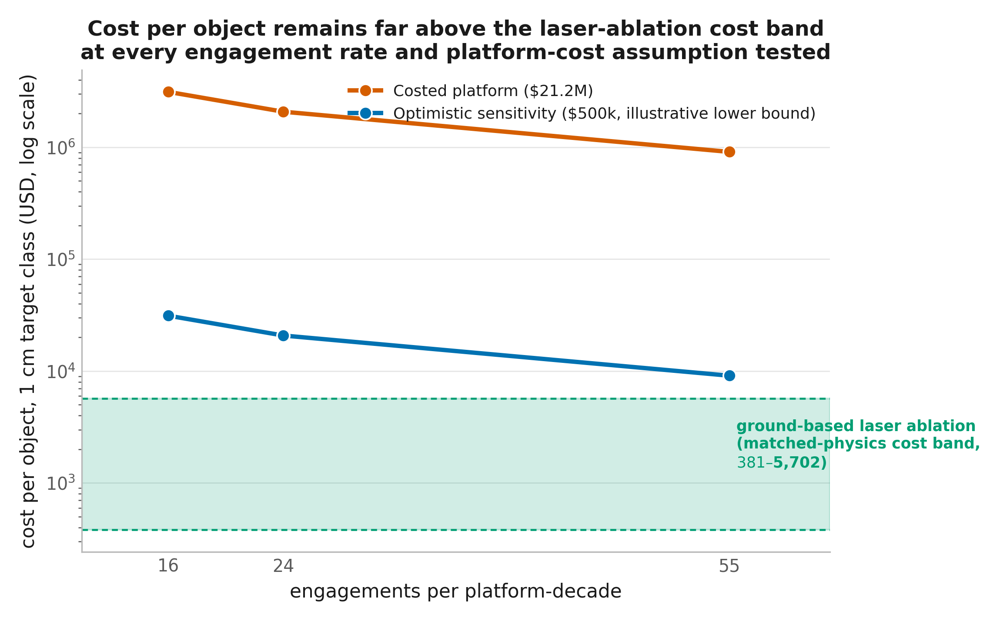
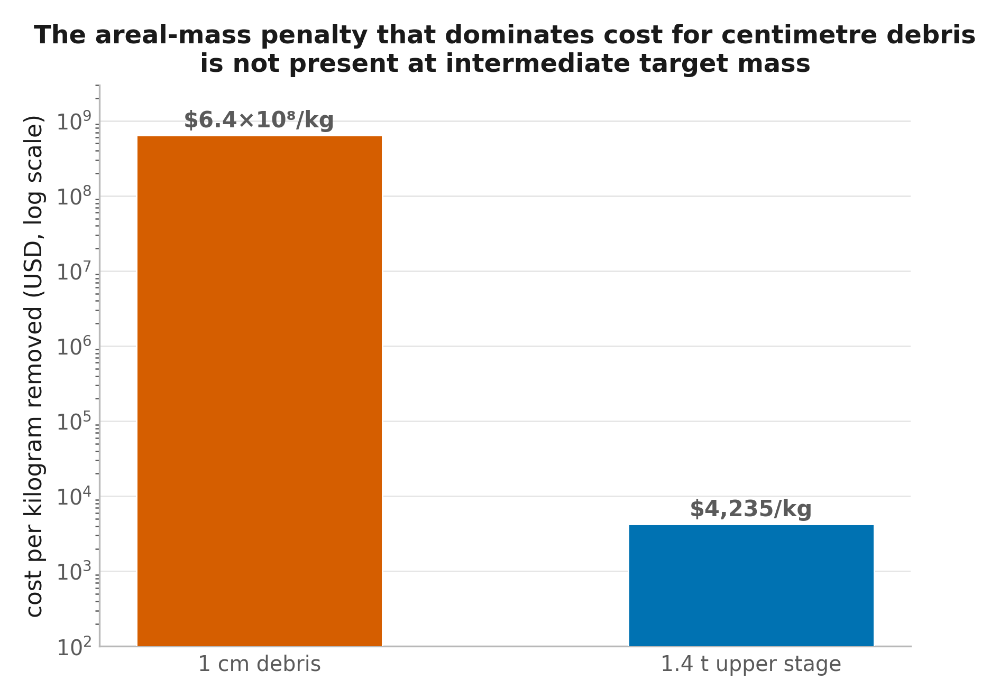

# 3. Results

Results are organized to mirror the module sequence in Section 2 (Table 2.14) and are presented as paired **Data** / **Interpretation** statements throughout: each finding is stated first as a quantitative result with its originating module, then interpreted against the research question it addresses. Section 3.11 (engagement cadence and cost) is marked explicitly as pending a revised platform-cost and mission-architecture analysis and is not asserted here; every other subsection reports figures already validated in the project record.

## 3.1 Catastrophic-disruption boundary: direct versus accelerated reentry

**Data.** Evaluating Equation (1)–(3) across 400–1200 km altitude, using the originally assumed momentum-enhancement value (β = 1.5, engineering margin γ = 2) so that this sweep is evaluated on a consistent basis, shows that direct reentry (perigee lowered to 100 km in one engagement) requires Δv of 87.4–290.0 m/s and yields a design-point specific energy of 36.1–119.7 kJ/kg — at or above the 40 kJ/kg catastrophic-disruption threshold at every altitude tested. Accelerated reentry (a fixed 200 km orbit-lowering decrement) requires only 48.7–57.7 m/s over the same range, yielding 20.1–23.8 kJ/kg — below the threshold at every altitude, with the safe intercept-velocity ceiling correspondingly rising from 2,079–2,463 m/s (SIM-0). Balancing this altitude-dependent safety margin against the altitude-dependent remediation value established in Section 3.6 selects 900 km as the operating point carried through the remainder of this section, at a fixed 619 m/s intercept velocity (SIM-13).

**Interpretation.** The two deorbit modes are not interchangeable design choices with similar risk: direct reentry places the design point at or above the catastrophic-fragmentation gate by construction, independent of engineering margin, while the accelerated-reentry redesign clears the same gate with room to spare across the full altitude band tested. This is the structural result that makes every downstream module in this section evaluable at all. The specific-energy figures above use the originally assumed β = 1.5; Section 3.2 replaces this with a physically derived value and recomputes the design-point figure accordingly, so the two should not be read as competing estimates of the same quantity.

## 3.2 Momentum coupling: β from crater-ejecta scaling

**Data.** The momentum-enhancement factor β, computed from crater-ejecta scaling rather than assumed, is 1.17–1.68 (central 1.30) at the 619 m/s design velocity, falling to an oblique-incidence-corrected value of 1.20 when averaged over a curved target surface. The same scaling relation evaluated at 6 km/s reproduces β ≈ 2–3, matching literature values for hypervelocity impact and asteroid-deflection experiments (CHK-01, INT-2). Embedding depth for a 450 μm grain at 619 m/s is 1.46 mm — 3.2 times the grain diameter, well short of perforating a 1 cm target. Substituting this corrected β = 1.20 into Equation (3) at the 900 km/619 m/s operating point selected in Section 3.1 raises the design-point specific energy from 21.4 kJ/kg (at the originally assumed β = 1.5) to 26.7 kJ/kg — 0.67× the catastrophic threshold, and the figure carried through the remainder of this section and the Abstract.

**Interpretation.** β is derived, not fitted or assumed, and its hypervelocity limit reproduces independently reported values, which is the validation check for the scaling relation. At the design velocity the impact is embedding-dominated rather than ejecta-dominated, which is the physical reason β sits close to its floor of 1.0 rather than the higher values sometimes assumed in early-stage designs. The correction raises required projectile mass by a factor of 1.25 and the design-point specific energy by the same factor, but the result remains comfortably sub-catastrophic — the qualitative finding of Section 3.1 is unchanged by the correction, only its exact margin.

## 3.3 Cloud areal density and mass efficiency

**Data.** For a Gaussian transverse cloud profile, the fraction of launched mass incident on a 1 cm target (ε) is 0.527 at a 2 cm cloud diameter, 0.113 at 5 cm, 0.0295 at 10 cm, and 0.0075 at 20 cm — a factor of approximately 3 more favorable at every cloud size than the uniform-disc estimate used previously (0.25, 0.04, 0.01, 0.0025 respectively), validated against grain-by-grain Monte Carlo to within 2.16 Monte Carlo standard errors (INT-1).

**Interpretation.** A peaked (Gaussian) cloud profile concentrates mass where the target actually is, which is a purely geometric correction to the earlier, more conservative uniform-disc assumption; it lowers required launched mass by roughly a factor of three at fixed miss tolerance without any change to the underlying physics of momentum transfer.

## 3.4 Aggregate delivery, aim tolerance, and secondary debris

**Data.** At the design point (1 cm target, 900 km, β = 1.201, 619 m/s, 5 cm cloud), 1.75 g of launched projectile mass delivers 197 mg on target via 197 individual grain impacts, meeting the required Δv on 91% of simulated shots; a 10 cm cloud raises this to 99.98% at a proportionally higher launched mass (INT-3/4). The resulting 197 impact craters excavate 370 mg of target material (26% of target mass); the largest single crater is 1.39 mm across — a factor of seven below the 1 cm trackability threshold. Net trackable-object flux per engagement, counting the target removed against any new fragment at or above 1 cm, is +1 (INT-5).

**Interpretation.** Aim error degrades delivered momentum continuously through the areal-capture fraction rather than causing a binary hit/miss outcome, so a larger cloud buys reliability at a quantifiable, finite mass cost rather than encountering a cliff. Net debris production is evaluated here from crater geometry directly rather than by extrapolating a hypervelocity fragmentation model outside its calibration range, and it shows no new trackable fragments are produced at the design point — a stronger and more directly grounded version of the non-catastrophic finding in Section 3.1.

## 3.5 Engagement geometry and terminal guidance

**Data.** Isolating engagement geometry from the engineering-margin question addressed in Sections 3.1–3.2 (i.e. evaluated at γ = 1, no safety margin, so that the comparison below reflects geometry alone), delivering a fixed 51.8 m/s retrograde kick from a co-orbital, launcher-supplied approach costs 13.9 kJ/kg of specific energy; delivering the identical kick from any crossing geometry — evaluated from 0.1° to 90° of plane offset — costs 333.5 kJ/kg, invariant of the specific crossing angle, and 8.3 times the catastrophic threshold. Co-orbital engagement is therefore more energy-efficient by a factor of 2·v_orbital/|w| = 23.9, verified against explicit three-dimensional orbital states to 2.8×10⁻¹¹ (cosine) and 2×10⁻¹⁶ (relative-velocity magnitude). Within the resulting admissible engagement cone (≤1.5° for a ≤10% energy penalty, ≤5° to remain sub-catastrophic), the terminal miss-distance budget at the design range (10 m) totals 5.775 mm and is dominated by launcher pointing and muzzle-velocity dispersion rather than by control-loop latency, which contributes negligibly across the tested range of 0.1 μs to 100 ms (SIM-4, INT-0).

**Interpretation.** Co-orbital engagement was previously treated as a guidance-driven design preference; it is shown here to be a kinematic requirement forced by momentum balance before guidance performance enters the analysis at all; a crossing engagement is excluded on energy grounds regardless of how well it can be aimed. This finding independently accounts for why terminal-guidance miss distance is insensitive to control latency in the redesigned engagement — the earlier concern that control-loop latency would collapse hit probability applies to a crossing-style engagement geometry that the energy gate already rules out.

## 3.6 Orbital decay and post-engagement lifetime

**Data.** For a 1 cm target, natural (unkicked) orbital lifetime rises from 0.06 yr at 400 km to 63.5 yr at 900 km and beyond 200 yr above 1200 km; a single 200 km accelerated-reentry kick reduces post-engagement lifetime to 0.004–18.2 yr over the same range, an acceleration factor of 16.7× at 400 km falling to 3.5× at 900 km. The orbit-averaged propagation model is cross-validated against full three-dimensional Cartesian integration to 0.01% over 400 revolutions and against a documented decay history to within 9.8% (SIM-2).

**Interpretation.** The kick is most effective exactly where it is least needed (low altitude, already-short natural lifetime) and least effective where debris density is highest (600–1000 km); the resulting single-kick altitude ceiling (900 km for 1 cm debris under the 25-year rule) is a genuine, altitude-dependent limit on remediation value rather than a free design parameter, and it is validated to the same standard used elsewhere in this study rather than taken from a fitted curve.

## 3.7 Reentry ablation and ground-casualty risk

**Data.** Design-range projectile grains (0.05–1 mm) and target debris up to 5 cm fully demise on reentry under rate-limited stagnation-point heating; a surviving 10 cm fragment retains only 5×10⁻⁴ J of impact energy. Ground-casualty expectation is effectively zero at every tested population density, against the accepted 10⁻⁴ per-event threshold (SIM-8).

**Interpretation.** Neither the target debris nor the projectile material at the sizes this design actually uses poses a measurable reentry hazard; this removes ground-casualty risk as a binding constraint on the concept, independent of the outcome of any other section.

## 3.8 Launcher: electromagnetic and chemical-propellant alternatives

**Data.** Rhenium cannot be driven by a reluctance coilgun (its paramagnetic susceptibility, χ ≈ +7×10⁻⁵, gives a ferromagnetic armature nothing to grip) or serve as its own induction armature (conductivity 5.42×10⁶ S/m, 11 times worse than copper); the design therefore uses a thin aluminium canister as a combined armature and payload container, with no discarded sabot, independent of target size. For FG01's actual small-debris design shot — 1.75 g of rhenium/tungsten payload (Section 3.4) plus its aluminium canister/armature, 2.14 g total accelerated mass at 619 m/s, 410 J kinetic energy — the required coilgun performance sits 80,491× inside demonstrated electromagnetic-launch hardware (GUN-01). A separate comparison, sized instead to a 100 g projectile — the regime relevant to the larger, intermediate-mass target class considered separately in this study, where required muzzle energy is roughly 20× higher — finds a multistage induction coilgun at 619 m/s requires 95.3 kJ of stored capacitor energy across 67 stages (2.95 m), essentially invariant across a tenfold range of acceleration limit, against a chemical-propellant alternative delivering 400 m/s from the same 100 g mass at 85.4 MPa peak chamber pressure (25 mm bore, 0.6 m barrel, 15% margin below the pressure limit; a 20 mm bore cannot reach 400 m/s within the same limit at any barrel length tested). At this larger payload mass, total system mass favors the chemical-propellant launcher below roughly 1,600 shots and the coilgun above it. Recoil per shot at 100 g is 43.4 N·s, equivalent to 4.34 m/s of Δv to a 10 kg spacecraft, requiring a platform of at least 600 kg to hold per-shot recoil below 0.1 m/s (GUN-01, COIL-01, CHK-01).

**Interpretation.** The choice of launcher technology is not a single, concept-wide decision but depends on which target class is being engaged. For FG01's actual small-debris design shot, launcher physics is not a limiting constraint by a wide margin, and the coilgun is the appropriate choice with no chemical-gun alternative competitive at that scale. The 100 g comparison is a separate question, relevant only if the larger intermediate-mass target class is pursued (Section 3.11): there, the coilgun's fixed stored-energy requirement across acceleration limits means canister structural design rather than energy storage drives its length, the chemical-gun result shows recoil rather than internal ballistics is its binding constraint, and which of the two is preferable depends on achievable shot count in a way it does not for the small-debris design point. Rhenium's incompatibility with reluctance or induction self-acceleration holds at either scale and is a third, independent finding against using it directly as the accelerated body, alongside the cost and supply findings in Section 3.9.

## 3.9 Material trade study

**Data.** Momentum delivered at fixed mass is identical for rhenium and tungsten (p = mv is density-independent). Tungsten is priced at $30–100/kg against rhenium's $2,486–7,283/kg (73–243× cheaper), with annual global production of ~84,000 t against rhenium's 60–81 t (1,037× greater). At equal grain mass, tungsten's marginally lower density gives a marginally higher area-to-mass ratio, so missed tungsten grains decay faster, not slower, than rhenium grains of the same mass (SIM-7).

**Interpretation.** Momentum transfer at fixed mass carries no density term, so density is not the source of rhenium's performance in this design; rhenium, retained as the reference implementation throughout this study, delivers the required impulse successfully regardless. Material choice is a secondary consideration for this concept rather than a determinant of feasibility: an alternative such as tungsten costs less and is more abundant, with no penalty to momentum transfer and no disadvantage on missed-grain persistence — but Section 3.11 shows this difference is immaterial to the concept's overall economic competitiveness with laser ablation, which is governed by platform cost and engagement cadence instead.

## 3.10 Comparative benchmarking against laser ablation (accuracy dimension)

**Data.** Built from matching physics rather than a quoted cost figure, a ground-based laser's terminal pointing requirement is 0.21 μrad against the present concept's 876 μrad — a 4,115× difference in angular terms. Measured against each system's own diffraction limit, the present concept operates with 131× headroom, against 1.64× for the laser. In absolute linear terms, however, the present concept requires the tighter figure: a 9 mm cloud must be placed on a 1 cm target, against the laser's 25 cm effective spot radius, a 28.8× tighter linear requirement — the angular comparison and the linear comparison point in opposite directions, and only the angular framing (which governs pointing-hardware and diffraction-limited-optics feasibility) is the operative one. A ground-based laser's terminal sensor tracks an unresolved point source (16× below its own diffraction limit) against the present concept's resolved target (149× above); the laser's failure mode on aiming error is a threshold cliff (full effect below 1.01× tolerance, zero beyond), against a smooth, continuous falloff for the present concept (45% of nominal momentum still delivered at 2× nominal aiming error); the laser requires 294 consecutive successful pulses per engagement against one aiming solution for the present concept; and a space-based variant of the same laser mechanism closes the ground-based system's demonstrated-hardware gap entirely (444 W of average power at 10 km range, against 93 kW for the ground-based case) but is shown to retain the same angular-pointing disadvantage at every range (1.68 μrad required, against the present concept's 876 μrad, a 521× difference) because its diffraction-limited spot size and range scale together (LAS-1, LAS-2, LAS-4, non-cost findings).

**Interpretation.** The present concept's angular pointing tolerance is not evidence of superior sensing hardware; it is a consequence of operating at short range, where the same absolute linear precision maps to a much looser angular requirement than a laser's necessarily long stand-off distance allows — and the linear comparison, which points the other way, must be stated alongside the angular one rather than omitted, since quoting only the angular figure would overstate the case. What is not geometry-dependent is the difference in failure mode: a dispersed-mass engagement degrades gracefully under aiming error because delivered momentum is continuous in miss distance, while a focused-beam engagement is a threshold process that delivers either the full designed effect or none. This distinction, and the requirement for hundreds of consecutive successful pulses per laser engagement against a single aiming solution for the present concept, hold regardless of whether the laser is ground- or space-based.

## 3.11 Engagement cadence and cost

**Scope note.** This subsection reports the currently validated engagement-cadence and cost model (ECO-1–ECO-5). It supersedes an earlier joint physical-and-economic viability figure (P(viable) = 0.667–0.997) computed in this study's preceding iteration (SIM-12/13), for the reason given below. If a revised platform-cost or mission-architecture analysis is completed after this draft, the figures in this subsection are what it would need to update, and any difference from them should be reconciled explicitly rather than presented as a fresh, unrelated result.

**Methodology.** Achievable engagement rate is derived, not assumed: opportunity count (fragments whose orbital plane sweeps through the platform's firing cone) and per-engagement transfer cost both scale linearly with the width of the altitude band serviced and cancel exactly, giving the closed-form invariant Δv per engagement = π·v_orbital/(3.5·Ω̇·T_mission), where Ω̇ is the target cluster's nodal regression rate and T_mission is mission duration; this is validated to 1.14% against a full numerical tour simulation before being used in the cost model (Section 2.9). Cost per object follows the structural relation C_object = (C_platform + C_ops)/N_eng + m_L·P_material + E_shot·P_elec (Equation 4, Section 2.10): C_platform is a costed subsystem-mass-fraction design (structure, avionics, power, launcher, propulsion, thermal control) priced at $50k/kg build and $3k/kg dedicated launch; N_eng is the engagement count from the cadence invariant above; m_L is launched projectile mass from the areal-capture delivery model (Sections 3.3–3.4); P_material is dated USGS Mineral Commodity Summaries pricing for rhenium and tungsten; and E_shot is launcher electrical energy (Section 3.8). Two robustness checks are applied to this model rather than reporting the costed figure alone: a platform-cost sensitivity sweeping C_platform down to an illustrative, largely unsupported $500,000 lower bound, to test whether the conclusion depends on the specific costed design; and a target-class sweep applying the identical cost relation to a representative intermediate-mass object, to test whether the areal-mass penalty that dominates cost for centimetre debris is a general property of the architecture or specific to that size class. The laser-ablation comparator (Section 3.10) is priced under the same engagement-geometry assumptions used for FG01 — matched aperture, tracking, and pointing requirements derived from the same physics — rather than adopting an externally published $/kg figure without re-deriving it.

*Figure 7. Cost per object for the 1 cm target class across the tested engagement-rate range (16–55 per platform-decade), for the costed platform design ($21.2M) and the illustrative optimistic sensitivity case ($500k), against ground-based laser ablation's matched-physics cost band ($381–$5,702). [View on GitHub](https://github.com/KakiroX/FG01/blob/main/manuscript_figures/fig7_cost_vs_engagements.png).*

**Data — engagement rate.** For the debris-populated shell with the highest remediation value among those examined (Fengyun-1C, sun-synchronous, ~865 km), the propulsive cost to reach a fresh target is not a free design parameter: opportunity count and per-engagement transfer cost both scale linearly with the width of the altitude band serviced and cancel exactly, giving a closed-form invariant, Δv per engagement = π·v_orbital/(3.5·Ω̇·T_mission), validated to 1.14% against a full numerical tour simulation. This evaluates to 106.9 m/s per engagement at Fengyun-1C over a 10-year mission; a simulated 10-year tour returns 16, 24, and 55 engagements at 500, 2,000, and 10,000 m/s Δv budgets respectively (ECO-1, ECO-2).

**Data — cost per object, 1 cm target class.** Using the structural cost relation C_object = (C_platform + C_ops)/N_eng + m_L·P_material + E_shot·P_elec (Equation 4), with a costed 400 kg dry platform ($21.2 M at $50k/kg build, $3k/kg launch) and consumables of $159 per mission total (Section 3.14), cost per object is $3.13 M, $2.08 M, and $0.91 M at the 16-, 24-, and 55-engagement cases above; the study's stated headline range across its full parameter sweep is $0.9 M–4.2 M per object. Fleet scaling does not change this materially: 1,000 platforms reach 24,000 objects (2% of the ≥1 cm population) at $412k/object with a standard learning-curve discount (ECO-3, ECO-4).

**Data — sensitivity to an optimistic platform-cost assumption.** The $21.2 M platform figure above is a costed design (structure, avionics, power, launcher, propulsion, thermal control at standard subsystem mass fractions), not the cheapest platform physically conceivable. As a lower-bound sensitivity check: an illustrative $500,000 platform cost — approximately 42× cheaper than the costed design, and below any demonstrated spacecraft carrying comparable terminal optical tracking, a multistage coilgun, and station-keeping propulsion — gives cost per object of $31,300, $20,800, and $9,100 at the 16-, 24-, and 55-engagement cases above. Against ground-based laser ablation's matched-physics $381–$5,702 range, this is still more expensive in every pairing: from 1.6× (the most favorable comparison, 55 engagements against the laser's own highest cost) to 82× (the least favorable, 16 engagements against the laser's lowest cost); at the central 24-engagement case alone, the multiple is 3.6–55× across the laser's cost range. Substituting tungsten for rhenium changes material cost by at most a few hundred dollars per mission (Section 3.9, 3.14) against either platform-cost scenario, a negligible fraction of the total in both cases.

**Interpretation — platform-cost sensitivity.** A 42-fold reduction in platform cost, beyond anything this study has actually engineered or found demonstrated elsewhere, is not sufficient to reach cost parity with laser ablation; the conclusion that the present concept is not cost-competitive with laser ablation for the 1 cm target class is therefore robust to platform-cost uncertainty specifically, not an artifact of a conservative or pessimistic cost estimate. Because material cost is negligible against either platform-cost scenario, the rhenium-versus-tungsten choice (Section 3.9) affects cost-competitiveness with laser ablation not at all — the binding term in Equation 4 is C_platform/N_eng in every scenario tested, not m_L·P_material.

**Data — cost per object, intermediate-mass (100 kg–3.7 t) target class.** Applying the identical launcher physics and cost relation to a representative 1.4 t upper-stage target (same 619 m/s intercept, same 26.7 kJ/kg specific energy, since specific energy is mass-independent) gives $5.9 M per object and $4,235 per kg removed, against $6.4×10⁸ per kg for the 1 cm class — the areal-mass penalty that dominates cost for centimetre debris is a non-issue at this scale (Section 3.4). Compared against an electric tug of equal platform cost, the momentum-kick architecture is cheaper below ~56 kg of target mass (the tug must accelerate its own several-hundred-kilogram bus; the kick's projectile carries no dead mass), breaks even near 100 kg, and falls behind by $0.74 M at 1.4 t and $4.89 M at 8.3 t, once projectile-mass fraction (14% of target mass, from the effective specific impulse v_eff = β·v_rel = 743 m/s ≈ 76 s equivalent I_sp — worse than cold gas) and recoil-cancellation propellant are both charged (ECO-5).

*Figure 8. Cost per kilogram removed collapses by more than five orders of magnitude between the 1 cm target class and a representative 1.4 t intermediate-mass object, because the areal-mass penalty (Section 3.3–3.4) that dominates small-debris cost does not apply once the target is larger than the delivered cloud. [View on GitHub](https://github.com/KakiroX/FG01/blob/main/manuscript_figures/fig8_cost_per_kg_by_target_class.png).*

**Data — reconciliation with the laser-ablation comparison (Section 3.10).** Built from matching engagement-geometry assumptions rather than the naive $100–500/kg figure, ground-based laser ablation costs $381–$5,702 per 1 cm object; against FG01's $0.9–4.2 M for the same target class, the gap is 2–4 orders of magnitude, narrowed from an apparent 5–6 orders under the uncorrected comparison, but decisively unchanged in direction.

**Data — economic viability.** The preceding iteration of this study (SIM-12/13) propagated engagement count as an epistemic uncertainty over a log-uniform prior (10³–10⁵ per platform lifetime) and reported P(viable) rising from 0.667 to 0.997 above 10⁴ engagements, with engagements-per-platform-lifetime and altitude identified by Sobol sensitivity as the dominant drivers of output variance (S_T = 0.519 and 0.497 respectively). ECO-1 replaces that sampled prior with a derived value: engagement count is not epistemically uncertain, it is fixed by orbital mechanics at approximately 24 per platform-decade for the best cluster examined. Checked against six viability conditions evaluated jointly (co-orbital premise, momentum coupling, cluster engageability, Δv affordability, net debris, material choice), conditions on cluster engageability and Δv-affordable engagement count fail; the other four pass. The joint criterion is a logical AND across all six, so the verdict is deterministic rather than probabilistic at the corrected input: **not economically viable for the 1 cm target class** (ECO-1–ECO-4, Part IV).

**Interpretation.** The dominant Sobol parameter from the preceding probabilistic model turned out to have a closed-form answer once actually derived, rather than remaining a free uncertainty to be favorably sampled — which is why the economic-viability conclusion changes from a probability approaching 1 to a deterministic no, and why that change is a correction rather than a new finding contradicting the old one on the same evidence. The cost gap against the object's expected remediation value compounds this: removing one ≥1 cm fragment avoids $67–$20,124 of expected collision loss depending on assumption, and at most ~$67 in the range consistent with the observed satellite-loss record, against a $0.9–4.2 M cost — a gap of 10²–10⁵×, independent of the platform-cost or engagement-rate assumption used. Against ground-based laser ablation the gap is smaller once both sides are priced on a matched basis (2–4 orders of magnitude rather than 5–6) but is not closed, and the same orbital-mechanics cadence limit is shown in Section 3.10 to bind a space-based laser identically, so it is not a competitor that escapes this result either. The one regime in which the architecture is cost-competitive — not efficient, and not the original design target — is intermediate-mass objects of order 100 kg to a few tonnes against a robotic tug, and only if avoiding rendezvous is judged to be worth the several-million-dollar premium that regime still carries above ~1 t; this is a programmatic judgment the present analysis does not settle.

## 3.12 Synthesis: technical feasibility of the redesigned engagement

This subsection is scoped deliberately: it establishes *technical feasibility* — that the redesigned concept violates no physical law, safety threshold, or demonstrated-technology limit at its design point — as distinct from *economic or operational viability*, which Section 3.11 addresses directly and finds not met for the original target class.

**Data.** At the selected operating point (900 km altitude, 619 m/s intercept), five independent technical gates are each cleared with a stated, verified margin, rather than assumed: (i) impact specific energy is 26.7 kJ/kg, 0.67× the catastrophic-disruption threshold, using a momentum-enhancement factor derived from physics rather than assumed (Sections 3.1–3.2); (ii) the required engagement geometry is shown to be a kinematic necessity rather than a design preference, and resolves the terminal-guidance miss-distance problem independently of control-loop latency (Section 3.5); (iii) net trackable-object flux is +1 per engagement, computed from crater geometry directly rather than by extrapolating a fragmentation model outside its calibration (Section 3.4); (iv) neither target debris nor projectile material at the design sizes used poses a measurable reentry or ground-casualty hazard, against the accepted 10⁻⁴ per-event threshold (Section 3.7); and (v) required launcher performance sits 80,491× inside demonstrated electromagnetic-launch hardware (Section 3.8). A sixth, comparative check — terminal pointing tolerance against the only other non-rendezvous method addressing this target class, laser ablation — shows a substantial angular-tolerance and graceful-degradation advantage, on a matched-physics basis rather than a quoted benchmark (Section 3.10).

**Interpretation.** Each of these six findings was, in an earlier iteration of this analysis, an independent basis on which the concept failed (Introduction): the energy margin forced catastrophic fragmentation, terminal guidance collapsed at realistic latency, and net debris was strongly negative. The redesign resolves all three by changing the engagement's Δv target and geometry, not by relaxing any physical threshold, and the remaining technical gates (reentry safety, launcher hardware, comparative accuracy) were not previously in question and remain clear. Taken together, these results support the claim that the redesigned concept is technically feasible: no open physical, safety, or hardware-availability problem remains at the design point evaluated. This claim is independent of, and should not be conflated with, the separate question of whether the concept is economically viable at scale — a platform-cost and engagement-cadence question Section 3.11 addresses directly, finding the original small-debris target class not economically viable for reasons of orbital mechanics rather than physics. Technical feasibility is a necessary condition for that broader economic-viability question to be worth asking; it is not a substitute for answering it.

## 3.13 Cartridge charge sizing and the minimum-charge hazard

This subsection and Section 3.14 report an additive module (CART-01) that derives a per-shot rhenium charge law from quantities already established in Sections 3.1–3.4, rather than introducing new physics; it is not yet registered in the main simulation pipeline and is reported here as a design-support result.

**Data.** Required launched powder mass follows m_powder = clamp[C(h)·m_t·P(m_t), 50 g, 100 g], where C(h) = γ·Δv(h)/(β·v_rel) depends on altitude only weakly (0.1311–0.1553 across 400–1200 km, an 18% range) and P(m_t) = max(0.274·m_t^(−2/3), 1) is the areal-capture penalty of Section 3.4, with a crossover at target mass 143 g (diameter 4.7 cm) below which required powder scales as m_t^(1/3) and above which it scales linearly with m_t. The formula reproduces the areal penalty, mass-on-target, and required-powder figures of Sections 3.3–3.4 to within 0.00% by construction, since it is derived from the same expressions. Within the resulting 50–100 g cartridge range (a 2:1 adjustment), one fixed-size cartridge covers a single-shot debris-mass envelope of approximately 320–760 g (6.1–8.1 cm diameter) depending on altitude — a narrow niche in its own right, two to three orders of magnitude below the separate 100 kg–3.7 t intermediate-mass window identified elsewhere in this study, and not to be conflated with it. Below this envelope, firing the 50 g minimum charge at a normally focused cloud delivers specific energy far above the catastrophic threshold — 313 kJ/kg (7.8× threshold) at 1 cm debris, falling to 1.00× only at 240 g — because a fixed minimum charge cannot be reduced further to match a smaller target.

**Interpretation.** The charge law identifies a third debris-size regime, distinct from both the 1 cm design point (Sections 3.1–3.10) and the intermediate-mass niche, in which a single cartridge charge requires no in-flight adjustment at all. It also surfaces an operational hazard the rest of this study's single-target-mass analysis does not: a launcher built to a minimum charge floor will over-deliver momentum, and therefore risk catastrophic fragmentation, against any debris below that floor's matched mass — a failure mode of the hardware's dynamic range, not of the underlying momentum-transfer physics.

## 3.14 Charge dosing versus dispersion control

**Data.** Widening cloud dispersion so that only the required mass is incident on target — rather than reducing charge, which has a hard floor — restores specific energy to 26.7 kJ/kg (0.67× threshold) independent of target mass, at cloud diameters of 12–28 cm for the sizes in Section 3.13's hazard table; surplus powder still self-disposes on the same immediate-reentry trajectory established in Section 3.6. Comparing a fixed 81 g charge, a fixed 100 g charge, and an in-flight-dosed 50–100 g charge: only 81 g (plus the 19 g canister of Section 3.8) matches the 100 g total accelerated mass the coilgun design point assumes; 100 g alone requires 19% more accelerated mass and a proportionally larger capacitor bank (48.6 kJ/32.4 kg versus 40.8 kJ/27.2 kg). A 30 kg magazine yields 300–600 shots depending on scheme, against a realistic demand of approximately 48 shots per platform-decade (two per engagement at the ~24 engagements/decade found elsewhere in this study) — a 6–12× margin regardless of which charge scheme is used. The rhenium-cost difference between a dosed and a constant-charge scheme is approximately $9 per platform-decade.

**Interpretation.** None of the three things an in-flight metering mechanism could plausibly buy — magazine capacity, consumable cost, or small-debris safety — is actually constrained tightly enough to justify it: magazine capacity already has an order-of-magnitude margin over realistic demand, the consumable-cost difference is negligible against platform cost, and no charge setting within the mechanically achievable range reaches the sub-gram charge that the smallest debris in this study's target class would require regardless. The parameter that is genuinely load-bearing is cloud dispersion, not charge mass, and a fixed 81 g charge — rather than a fixed 100 g charge — avoids carrying capacitor mass to cover an accelerated-mass margin the mission does not use. This is consistent with, and adds an operational layer to, the Section 3.13 finding that the launcher's usable dynamic range, not its momentum-transfer physics, is what limits the debris-mass range a single shot can safely address.

---

*Figures and tables corresponding to each subsection above are to be inserted from the originating module's output directory (`figures/`, `outputs/`) once final figure numbering is assigned against the complete manuscript.*
